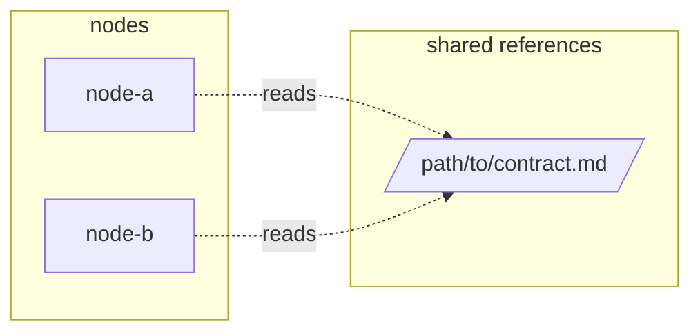

# Report template

The shape of the file written to `outputFile`. Keep the headings and the table columns; drop a row,
never a column. Finding ids are stable across re-reviews of the same workflow: `[W1]`, `[W2]`, … for
weaknesses, `[R1]`, `[R2]`, … for recommendations.

---

# Agentic Workflow Architecture Review — `<workflow name>`

| | |
|---|---|
| **Entry point** | `<resolved path>` |
| **Depth** | `standard` |
| **Focus areas** | `<list, or "none — all areas at equal weight">` |
| **Production context** | `<given, or "assumed: single team, single repo, human-supervised runs">` |
| **Date** | `YYYY-MM-DD` |
| **Graph** | `<n>` nodes, `<n>` shared references |
| **Files read** | `<n>` — list them at the end |

## 1. Overall assessment

| Score | Maturity | Confidence |
|---|---|---|
| `X/10` | `Production Candidate` | `Medium` — <what limits it> |

<2–4 sentences. What this workflow is, what it gets right structurally, and the single thing that
most stands between it and the next maturity level.>

## 2. Strengths

- **<Strength>** — `path:line`. Why it is non-obvious, not merely present.

## 3. Weaknesses

| Id | Component | Finding | Evidence | Action |
|---|---|---|---|---|
| W1 | `<agent/skill/artifact>` | <one sentence> | `path:line` | Remove |

Then, for each High-severity id, three lines:

**[W1] `<component>` — Redesign**
*Failure:* <concrete input or state → wrong outcome.>
*Fix:* <smallest change that removes the failure.>

## 4. Focus area — `<name>`

<Only when focusAreas was given. Same evidence rules. Judge against the named practice standards and
say which one is violated.>

## 5. Context efficiency

| Transition | Passed today | Minimum needed | Waste |
|---|---|---|---|
| `A → B` | full 400-line doc | ticket id + path | ~<n> lines copied per run |

### 5.1 Shared reference reuse

Files two or more nodes read. `Duplicated inline` is `no`, or the node + `path:line` that restates the
rule instead of reading the file.

| Shared file | Kind | Read by | Written by | Duplicated inline | Verdict |
|---|---|---|---|---|---|
| `<path>` | contract \| template \| etalon \| schema \| checklist | `<node>`, `<node>` | none | no | Keep |

<Then, in prose: which node pairs must agree and whether they read the same file; references loaded
into nodes that do not need them; references with a single reader; references that carry routing or
sibling knowledge the architecture keeps elsewhere.>

<Then the systemic issues: duplication, staleness, missing schemas, just-in-case generation.>

## 6. Workflow optimization

| Change | Agents before → after | Transitions before → after | Quality impact |
|---|---|---|---|

## 7. Missing capabilities

| Capability | Why it matters here | Cheapest form |
|---|---|---|

## 8. Recommendations

| Id | Priority | Change | Reason | Expected impact | Effort | Affected files |
|---|---|---|---|---|---|---|
| R1 | High | <imperative> | <why> | <what improves, quantified where possible> | Small | `path` |

Ordered High → Medium → Low; within a priority, cheapest first.

## 9. Final verdict

- <5–10 bullets, each a decision-grade claim.>

**Verdict: ⚠️ Approve with changes**

<2–3 sentences. Name the specific findings that must close before the verdict changes.>

## Appendix — files read

- `path` — why it was read. Mark shared references as `shared — read by <node>, <node>`.
