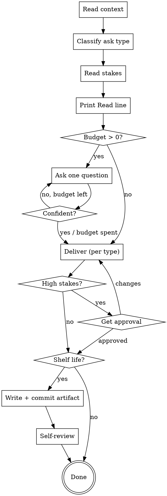

# Grill Me

Turn a vague ask into a sharp answer by asking the few questions that actually change the answer — then deliver, at a ceremony level matched to what is at stake.

Not a design skill. Not a spec skill. A **general** one: any question where guessing intent is the risk.

## Two-minute version

1. Read what you can look up. Never ask what the repo, the file, or the conversation already answers.
2. Classify the ask. Read the stakes.
3. Print the **Read line** — ask type, stakes, question budget, gate. One line, out loud.
4. Grill. One question per message, inside the budget, every question decision-relevant.
5. Deliver in the shape the ask type calls for.
6. Write a file only if the answer has a shelf life.

## The one rule that makes this not annoying

**Ask only a question whose answer changes what you produce.**

Before every question, run the test: *if they answer A, and if they answer B — do I write something different?* If not, the question is not a question, it is a delay. Cut it and use your own judgement.

Corollaries:

- **Zero questions is a legal budget.** A fully specified ask does not get grilled. Grilling a clear question is theater.
- A question you can answer yourself by reading a file is not a question. Read the file.
- A question that is really you asking permission to think is not a question. Think.

## Step 1 — Read before you ask

Spend the first move on context, not on the user:

- Files, code, docs, recent commits, the open editor, earlier turns of this conversation.
- For a non-code ask: whatever the user already told you, whatever artifact they pointed at.

Every fact you find here is a question you do not have to spend.

## Step 2 — Classify the ask

Six types. Pick one — the type decides what "done" looks like and whether options are even the right shape.

| Ask type | Sounds like | Done means | Options? |
|---|---|---|---|
| **Decision** | "A or B?", "should we…?" | a recommendation, with the losing option's best argument stated | yes — 2-3 real ones |
| **Diagnosis** | "why is this broken/flaky/slow?" | ranked hypotheses + the cheapest test that separates them | no — hypotheses, not options |
| **Design** | "build/spec X" | a design the user approved | yes — 2-3 approaches |
| **Plan** | "how do I get from here to X?" | ordered steps, each with a done-condition | yes — sequencing alternatives |
| **Creation** | "write/name/open this" | the artifact itself, plus what you optimised for | yes — 2-3 directions, then draft one |
| **Explanation** | "how does X work?", "what am I missing?" | the model, at the depth they need | no — answer it |

Mixed asks exist. Name the dominant type, say the other is riding along, do not try to run two routes at once.

**Delegation:** if the type is **Design** and the ask is software to be built in this repository, hand off to the `brainstorming` skill and stop — that lane already has a canonical route ending in `writing-plans`. Duplicating it here would make two skills disagree about the same job.

## Step 3 — Read the stakes

Stakes are reversibility x cost x blast radius — **not** how hard the question is.

| Stakes | Test | Budget | Gate |
|---|---|---|---|
| **Low** | wrong answer costs minutes, trivially undone | 0-2 questions | none — answer, refine after |
| **Medium** | wrong answer costs a day, or rework | 2-4 questions | present the answer; no blocking approval |
| **High** | irreversible, expensive, public, or it lands on other people | 4+, no cap | **hard gate** — present, get explicit approval, only then act |

A **hard gate** means: no code written, no file sent, no command run, no other skill invoked, until the user has said yes to the shape of the answer.

Public, irreversible, or affects-others beats cheap-to-undo. A one-line config change that ships to production is high stakes. A 900-line refactor on a branch is not.

## Step 4 — Print the Read line, then grill

Before the first question, one line, out loud:

> **Read:** Decision · stakes high (irreversible, affects the team) · budget ~3 questions · gate on.

Say it because it is the one thing the user cannot reconstruct afterwards: why they got three questions instead of none, and why you stopped to ask permission. It also lets them overrule you in one word before you have spent anything.

Then:

- **One question per message.** A question wall is a form of giving up.
- **Multiple choice where the space is closed**, open-ended where it is not. Never invent four options for a yes/no.
- Order questions by how much they cut the space. Ask the one that could invalidate the others first.
- **Stop early on confidence.** The budget is a ceiling, not a quota.
- **Say when you are out of budget and still unsure** — then state the assumption you are proceeding on, and proceed. Never grind past the budget in silence.

## Step 5 — Deliver

Per ask type:

- **Decision** — recommendation first, reasoning second, then the strongest case *against* your pick, then **what would change your mind**. A recommendation with no falsifier is a preference wearing a suit.
- **Diagnosis** — hypotheses ranked by probability x cheapness-to-test, and the single next check that splits the field. Not a list of everything that could be wrong.
- **Design** — architecture, components, data flow, failure modes, how it gets tested. Sections scaled to their complexity: a sentence where it is obvious, 200-300 words where it is not. Approval after each section, not one approval at the end.
- **Plan** — ordered steps, each with a done-condition and its dependency. Flag the step most likely to fail.
- **Creation** — draft the thing. Do not present a menu of directions and stop; pick one, produce it, say what you optimised for and what you traded away.
- **Explanation** — answer at their level, then one line on what you left out and why.

Always close with a **confidence line**: what you are sure of, what you are assuming, what you would need to be sure.

Options must be **real**. Two straw men flanking your favourite is worse than presenting one option honestly — it fakes a choice the user never got.

## Step 6 — Artifact, only with shelf life

Chat is the default output. Write a file when the answer will be read again by someone who was not in this conversation.

| Ask type | Artifact |
|---|---|
| Decision with consequences | `docs/decisions/YYYY-MM-DD-<topic>.md` — question, options, choice, reasoning, falsifier |
| Design | `docs/specs/YYYY-MM-DD-<topic>-design.md` |
| Plan | `docs/plans/YYYY-MM-DD-<topic>.md` |
| Creation | wherever the artifact lives |
| Diagnosis | chat; a file only if the finding outlives the fix |
| Explanation, quick answer | chat only |

Say which you picked and why, in one clause. Offer the file the user did not get — *"chat only; say the word and I will write it up."*

If a file is written and the repository is under git, commit it. Respect any user preference for artifact location over these defaults.

## Step 7 — Self-review before handing over

Fresh eyes on what you produced. Fix inline, do not re-review:

1. **Placeholders** — any TBD, TODO, or hand-wave left standing?
2. **Contradictions** — does any part disagree with another part?
3. **Ambiguity** — could a requirement or step be read two ways? Pick one and say it.
4. **Scope** — did you answer the question asked, or a bigger one nobody asked for?
5. **Grill audit** — did every question you spent actually change this output? If one did not, that is the rule to tighten next time.

## Escape hatches

The user holds these at all times, and the skill obeys immediately:

| They say | You do |
|---|---|
| "just answer" | stop grilling now, answer on stated assumptions |
| "grill me harder" | raise the budget, keep going |
| "no file" / "write it up" | override the artifact decision |
| "skip the gate" | drop to present-without-approval, and say once that you did |

## Anti-patterns

- **The question wall.** Five questions in one message. Break them up or cut four.
- **Asking what the file says.** Reading is cheaper than asking and does not cost the user a turn.
- **Interrogating a trivial ask.** "What should I name this variable" does not get a stakes read and three questions.
- **Approval theater.** Asking "sound good?" on something reversible teaches the user their yes means nothing.
- **Fake options.** Two straw men and the answer you already chose.
- **Grilling instead of thinking.** Questions are for intent you cannot derive — not for judgement calls that are yours to make.
- **Answering the bigger question.** They asked which assertion to use, not whether the test suite is well architected.

## Process flow

## Key principles

- **One question at a time.**
- **Every question must change the answer.** Otherwise cut it.
- **Ceremony scales to stakes**, never to how interesting the problem is.
- **Say your read out loud** — type, stakes, budget, gate — before spending the user's turns.
- **Real options or one honest one.** Never a fake choice.
- **State your falsifier.** What would change your mind is part of the answer.
- **The user can always cut you off**, and cutting you off is not a failure.

## Portability

One file, no scripts, no references. Copy `.claude/skills/grill-me/SKILL.md` to `~/.claude/skills/grill-me/SKILL.md` to make it available in every project.
