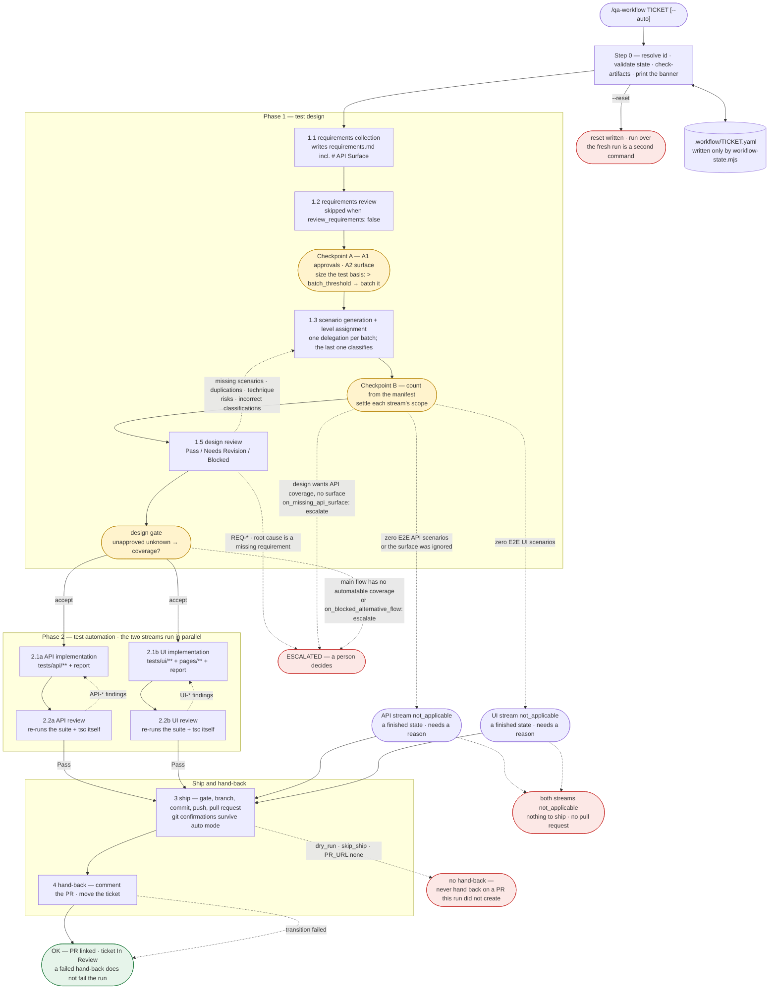
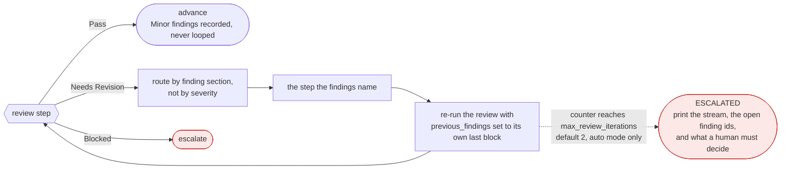
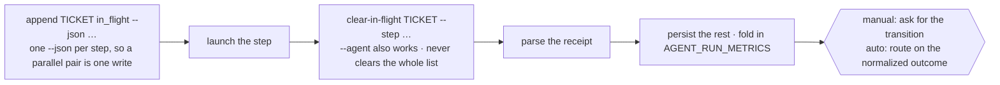

# The workflow map — the run as one picture

Read this **when the shape of the run is the question**: explaining the workflow to a user, orienting
after a resume that landed somewhere unexpected, or checking that a routing change has somewhere to
go. **Do not read it before an ordinary delegation** — the step registry in `SKILL.md` carries every
parameter and receipt line, and this file carries none of them.

It is part of the skill: same rules, including the one that no file here names an agent. Every node
below is a **step id**, never the thing that runs it — `SKILL.md`'s registry stays the only place two
agent names appear together.

**This file is canonical for nothing.** It is a picture of the routing that `SKILL.md` defines. Where
the two disagree, `SKILL.md` is right and this file is out of date.

---

## 1 — The run, end to end

Solid edge = advance. Dashed edge = a review sending work back, a gate stopping the run, or a stream
settling without running. **Every edge on this diagram is drawn by the orchestrator**; no step knows
what follows it.

---

## 2 — The gates

Four places the run can stop or narrow. Two of them are settings, and both settings default to stopping.

| Gate | Where | What it decides | Auto-mode setting |
|---|---|---|---|
| Checkpoint A | before the first 1.3 | which missing values a human approves (A1) · the API surface (A2) · one delegation, or `batch_size` ids per delegation | A1 stops on a `[REQ-C*]` against an in-scope AC |
| Checkpoint B | after 1.3 | each stream's scope, from `--emit-manifest` counts — never by hand | `on_missing_api_surface` (default `escalate`) |
| design gate | after 1.5 | whether an unapproved unknown leaves an in-scope requirement with no automatable coverage | `on_blocked_alternative_flow` (default `escalate`) |
| ship gate | inside step 3 | both reviews passed / both reports exist, read off the files rather than off a caller's claim | — |

Three things about the two settings, because each is easy to read as more than it is:

- **A relaxed gate approves nothing.** The blocked scenarios still ship `Manual only`, the unknown stays
  unapproved, no `Expected:` gains a value. The only thing it decides is whether a human is fetched now or
  reads the open question later.
- **`continue` covers alternative flows only.** A **main flow** stops the run under either value, and a
  mixed set stops it naming every requirement in the gap rather than only the blocking half. The test is in
  `phase-1-design.md`.
- **A relaxed gate is printed twice** — at the banner and at the gate. Why a run did *not* stop is the one
  thing nobody can reconstruct afterwards.

`not_applicable` is not a gate failing. It is a stream finishing without running, and it needs a stated
reason — one with nothing behind it is indistinguishable from a stream that was forgotten.

---

## 3 — The review loop and the cap

Three loops exist, one per reviewing step, each with its own counter. Manual mode caps none of them: every
loop there is already a human decision, and capping a decision somebody just made would be theatre.

**The counter tracks review rounds, not delegations.** A design review with findings in *both* design
buckets routes the classifying step first, then the generating step, then re-runs the review once — that
is **one** iteration.

**Never loop past the cap, and never lower the bar to clear it.**

---

## 4 — Every step is delegated in the same three moves

The first move comes **before** the launch. A step launched without its `in_flight` entry is invisible to a
resume: the session dies, and the next one cannot tell an interrupted delegation from one that never
started.

Nothing else writes that file. `workflow-state.mjs` re-emits the whole document from the parsed model on
every write, which is what makes a duplicate key unreachable rather than merely reported.

---

## 5 — Terminal states

Every one of these is an ending the return block has to cover. `terminal-return.md` owns the shape; this
is the list.

| Status | Reached from | Deliverable |
|---|---|---|
| `OK` | step 4, or a failed hand-back after a real PR | the pull request; the Jira status is bookkeeping |
| `ESCALATED` | a cap reached, a `REQ-*` finding, a stopping gate, a `Blocked` verdict | the open decision, named |
| `BLOCKED` | a step that could not proceed at all | what blocked it |
| `PAUSED` | any manual-mode question | resume with `/qa-workflow TICKET` |
| `DECLINED` | any question, in either mode — **the option is always present, always last** | reports *more* carefully than a completed run, not less |

A run that stopped early still cost what it cost and still left files behind, which is precisely when the
record matters most: the receipt block, then **Artifacts produced**, then **Agent run cost**, on all five.
