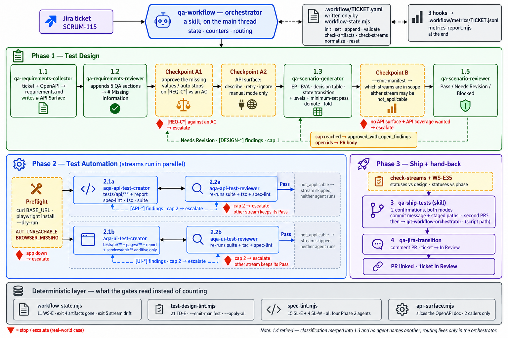

# Retro Video Games Portal — Test Automation

Playwright + TypeScript test automation for the **Retro Video Games Portal** app (API and UI), together
with a set of Claude Code subagents that take a Jira ticket and carry it through to merged tests.

Two things live in this repository side by side:

- **The suite** — `tests/`, `pages/`, `fixtures/`, `services/`, `framework/`, `utils/`.
- **The agent workflow** — `.claude/agents/`, `.claude/skills/`, `docs/conference/`, `requirements/`,
  `test-design/`.

`CLAUDE.md` is the working contract for both — conventions, layering rules and the reasons behind them.
Read it before writing a test; this file is the tour, that one is the law.

## Requirements

- Node.js and npm
- The application under test, already running at `BASE_URL` (`http://localhost:9000` locally).
  `playwright.config.ts` has **no `webServer` block** — nothing here starts the app for you.

TypeScript is pinned to 5.x. The `paths` aliases below are written against `baseUrl`, which TypeScript 7
removed, so a bump to 7 needs `tsconfig.json` migrated to relative `paths` first.

## Setup

```bash
npm install
npx playwright install          # browsers, for the ui project
cp .env.example .env            # then fill in the credentials
```

Check the app is up before running anything:

```bash
curl -s -o /dev/null -w "%{http_code}" http://localhost:9000/
```

## Commands

```bash
npm test                                     # whole suite, both projects
npm run test:api                             # api project only, no browser launched
npm run test:ui                              # ui project only, Desktop Chrome
npm run test:headed                          # headed run
npm run test:debug                           # Playwright inspector
npm run report                               # open the last HTML report
npm run typecheck                            # tsc --noEmit
npx playwright test tests/ui/owner.spec.ts   # one file
npx playwright test -g "add a new admin"     # one test by title
```

There is no ESLint in this repository, so there is no `lint` script.

`playwright.config.ts` declares two projects — `api` (`testDir: ./tests/api`) and `ui`
(`testDir: ./tests/ui`, Desktop Chrome) — and runs `fullyParallel`, with retries and single-worker
execution only under `CI`.

## Configuration

`.env` (gitignored) is read and validated by Joi in `framework/configuration/config.ts`, then exposed as
the static `Config` class. Validation runs **at import time**, so a bad `.env` fails the whole run before
any test starts rather than inside one.

| Key | Required | Default |
|---|---|---|
| `BASE_URL` | yes | — |
| `OWNER_EMAIL` / `OWNER_PASSWORD` | yes | — |
| `ADMIN_EMAIL` / `ADMIN_PASSWORD` | yes | — |
| `HEADLESS_BROWSER` | no | `true` |
| `PORT` | no | `9000` |
| `NODE_ENV` | no | `development` |

Adding a setting means editing three places: the Joi schema, the `Config` static, and `.env`. Never read
`process.env` outside that file, and never inline a credential in a spec.

Path aliases are declared in `tsconfig.json` and resolved by Playwright at runtime: `@framework/*`,
`@services/*`, `@fixtures/*`, `@tests/*`, `@utils/*`, `@pages/*`.

## Layout

```
tests/api/          API specs — import test/expect from @fixtures/api-fixture
tests/ui/           UI specs  — import test/expect from @fixtures/pages-fixture
pages/              page objects: locators + actions, never assertions
fixtures/           api-fixture.ts → pages-fixture.ts (the second extends the first)
services/api/       facade → controllers → request builders → endpoints.ts → toApiResult
framework/          Joi-validated Config
utils/              AdminTestData, AuthTestData, ResponsePatterns — every value a spec sends or matches
docs/automation/    etalons/ contracts/ references/ — what the agents read at run time (see its README)
docs/conference/    agent_build_plan.md — the concept: roster, phases, and why it is shaped this way
                    full-workflow.png, presentation-plan.md — the diagram above and the talk built on it
requirements/       <TICKET-ID>-requirements.md, written by the collector agent
test-design/        <TICKET-ID>-test-design.md, written by the generator agent
```

## How the suite is put together

**The fixture chain.** `@playwright/test → fixtures/api-fixture.ts → fixtures/pages-fixture.ts → specs`.
A spec never imports `test`/`expect` from `@playwright/test`. Because the pages fixture extends the API
fixture, a UI spec gets `api`, `ownerToken` and `createdAdminEmails` alongside its page objects in one
destructure. `ownerSession` seeds the JWT into `localStorage` through `addInitScript` **before** the first
navigation, because the app's `AuthContext` reads storage once on mount — a token written after `goto`
would not restore the session.

**The API layer.** `ApiFacade` → `AuthApi`/`AdminApi` controllers → fluent `*RequestBuilder` →
`toApiResult()`, which returns `{ response, status, ok, body }` and never assumes JSON, so a negative test
can assert a status without dying in a parse error. Which layer you use is decided by the phase:

- In an **API spec**, the `// Act` is always the builder with one `with*()` call per field sent, so the
  whole request reads at the point it is made. Controllers are for `// Arrange` and `// Assert` — the
  seed, the cross-check, the cleanup.
- In a **UI spec**, an API call is only a helper, so it takes the shortest controller form. No builders
  under `tests/ui/`.

**Page objects** hold `readonly Locator` fields assigned in the constructor and actions that return
locators; `expect` lives in the spec. Locators are `getByTestId` or `getByRole` only — a control with no
stable hook is a gap to report, not a reason for a CSS selector. Waiting is web-first assertions and
auto-waiting; `waitForTimeout` is not used.

**Test data** lives in `utils/`, never as a `const` in a spec. Each test creates its own record with a
unique e-mail (`AdminTestData.uniqueApiEmail()` in API specs, `uniqueUiEmail()` in UI specs, so the two
streams never collide) and registers it in `createdAdminEmails`, which deletes it over the API afterwards.
Expected response and rendered strings are the one literal that belongs in a spec, next to its assertion.

A known application defect is asserted against the specification, with a comment naming it — see the
`lastLogin` assertion in `tests/ui/owner.spec.ts`. Assertions are never weakened to turn a run green; the
failure is the report.

## The agent workflow



One Jira ticket in, one reviewed pull request out, and the same ticket moved to `In Review` with the pull
request linked on it. Solid arrows advance; dashed arrows are a review sending work back by finding id.
Every arrow on that picture is drawn by the orchestrator — no agent knows what runs after it.

Where to read next, depending on the question:

| Question | File |
|---|---|
| why the workflow is shaped this way — roster, phases, reasoning | `docs/conference/agent_build_plan.md` |
| the same picture in text, with the gates, the loop cap, the state write and every terminal state | `.claude/skills/qa-workflow/references/workflow-map.md` |
| who runs when, and with which parameters | `.claude/skills/qa-workflow/SKILL.md` — the step registry |
| what the agents read while running | `docs/automation/README.md` |

Eleven subagents in `.claude/agents/` split into two phases, each phase a create → review → revise loop:

| Phase | Agent | Reads | Writes |
|---|---|---|---|
| 1 | `qa-requirements-collector` | Jira, over the Atlassian MCP | `requirements/<TICKET-ID>-requirements.md` |
| 1 | `qa-requirements-reviewer` | that document | appends its review sections to it |
| 1 | `qa-scenario-generator` | the requirements | `test-design/<TICKET-ID>-test-design.md` |
| 1 | `qa-scenario-classifier` | the test design | assigns a level to every scenario, in place |
| 1 | `qa-scenario-reviewer` | both documents | a Pass / Needs Revision / Blocked verdict |
| 2 | `aqa-api-test-creator` | `Assigned Level: E2E API` scenarios | `tests/api/**`, `services/api/**` |
| 2 | `aqa-api-test-reviewer` | that code and its report | a verdict, cited by file and line |
| 2 | `aqa-ui-test-creator` | `Assigned Level: E2E UI` scenarios | `tests/ui/**`, `pages/**` |
| 2 | `aqa-ui-test-reviewer` | that code and its report | a verdict, cited by file and line |
| ship | `git-change-analyst` | the git working tree | nothing — returns a proposed commit message and PR facts |
| ship | `qa-jira-transition` | its prompt and Jira | comments the pull request on the ticket and moves it on |

Each Phase 2 creator also writes `.workflow/reports/<TICKET-ID>-<stream>-implementation.md` in the shape
of `docs/automation/contracts/implementation-report.md`; the matching reviewer reads it as its work list. That
directory is gitignored and does not exist until the first creator run.

Skills in `.claude/skills/` are the things that act on your behalf on the main thread, where they can ask
you first: `git-branch-creator`, `git-commit-creator`, `git-push-creator`, `git-pr-creator`,
`git-workflow-orchestrator`, and `qa-ship-tests`, which wraps the whole ship phase for a ticket. Note the
split — `git-change-analyst` is an **agent** that reads and proposes; only the `git-*` **skills** stage,
commit, push or open a pull request.

The one that drives the rest is `qa-workflow`:

```
/qa-workflow SCRUM-139            # manual — it asks what happens next after every step
/qa-workflow SCRUM-139 --auto     # routes on each verdict, capped at 2 review rounds per stream
/qa-workflow SCRUM-139 --reset    # archive this ticket's artifacts by rename, then start over
```

It is a skill rather than an agent for a mechanical reason: a subagent cannot spawn subagents and cannot
see skills, so anything that routes has to run on the main thread. It owns the state file
`.workflow/<TICKET-ID>.yaml`, the iteration counters and the routing — and does none of the work itself.
Manual mode is the default, and every question it asks carries a Decline option.

A second, independent workflow triages a Slack channel into Jira:

```
/slack-bug-triage                 # manual — asks before every ticket
/slack-bug-triage --auto          # routes on the duplicate verdict, capped at 5 tickets a run
/slack-bug-triage --dry-run       # touches neither Slack nor Jira nor the ledger
```

It reads `#bug-reports`, drafts a bug from each new message, checks SCRUM for an existing ticket, and
either files a new one or replies with the match — marking the message each time. It needs a Slack MCP
server and three OS environment variables (`SLACK_MCP_XOXB_TOKEN`, `SLACK_TRIAGE_CHANNEL_ID`,
`SLACK_TRIAGE_SELF_USER_ID`), plus a one-time `/invite` of the app into the triaged channel;
`.claude/skills/slack-bug-triage/references/slack-mcp.md` has the setup, the OAuth scopes and the two
gates that are off by default. What it does *not* rely on is the emoji: reactions
may be write-only on the installed server, so `.slack-triage/journal.jsonl` is the state and the marks are
decoration. That ledger is tracked in git — it is the only durable record that a Slack message already
became a ticket.

Design rules that hold across `.claude/agents/`:

- **No agent may name another agent**, anywhere in its file. Each is a pure function of its parameters and
  the files on disk, so routing stays in one place.
- **Reviewers get no `Edit` or `Write`.** A reviewer that can fix what it finds returns `Pass`, and the
  Needs-Revision signal disappears.
- The `aqa-` prefix marks every agent that writes or reviews test code; `qa-` agents touch only
  `requirements/` and `test-design/`. The slug prefix and the tool grant must always agree.
- The two Phase 2 streams run in parallel and own disjoint paths — API owns `tests/api/**`,
  `services/api/**`, `fixtures/api-fixture.ts`; UI owns `tests/ui/**`, `pages/**`,
  `fixtures/pages-fixture.ts`. `utils/**` is shared and additive only.

Browser exploration goes through the `playwright-cli` skill under the protocol in
`docs/automation/references/browser-exploration.md`: one named session per agent, always closed, snapshot refs never
committed, and no requirement ever derived from what the UI currently does.
