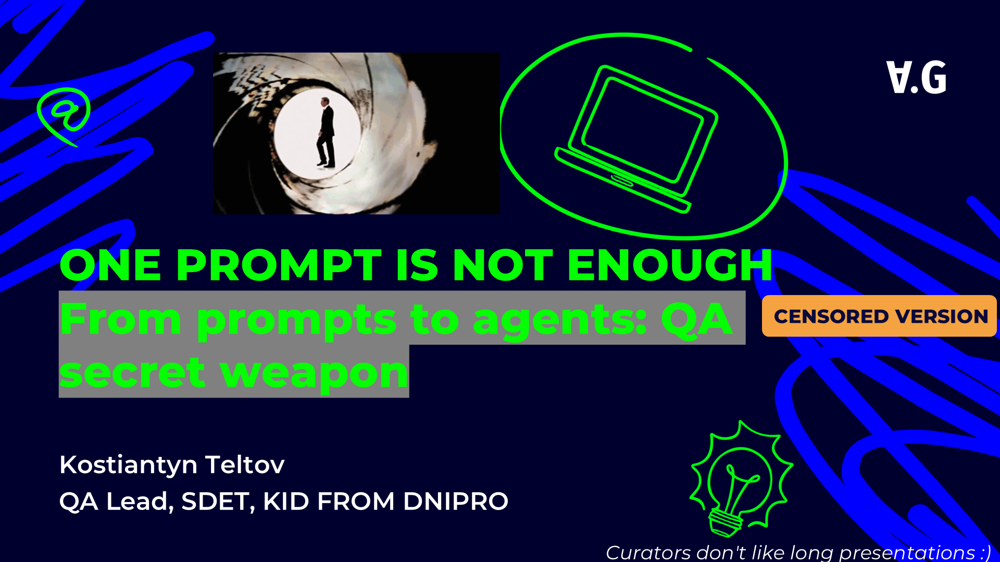
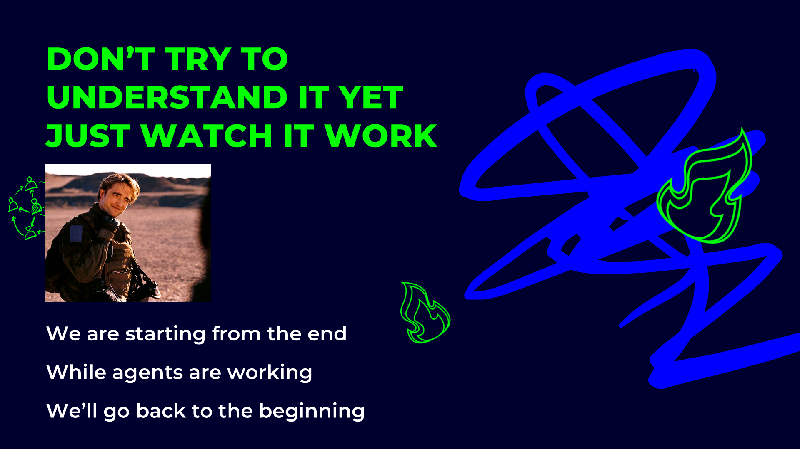
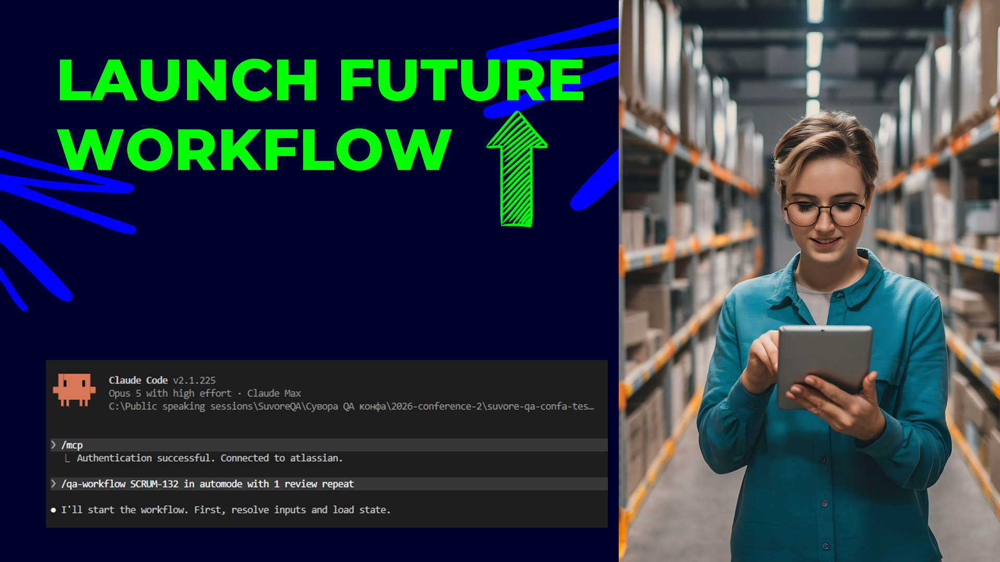
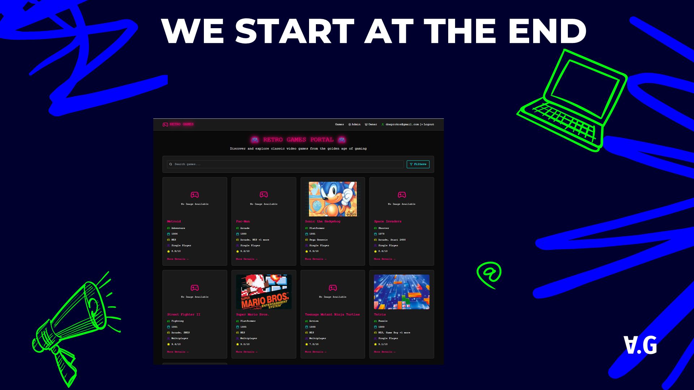
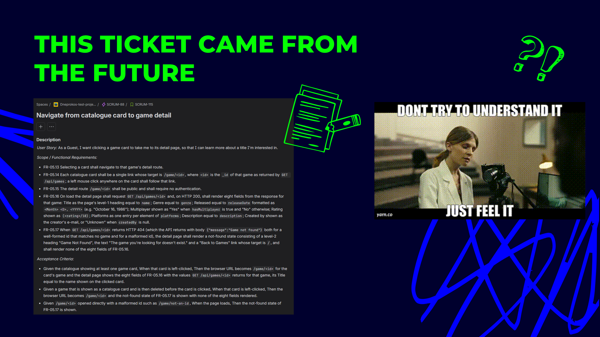
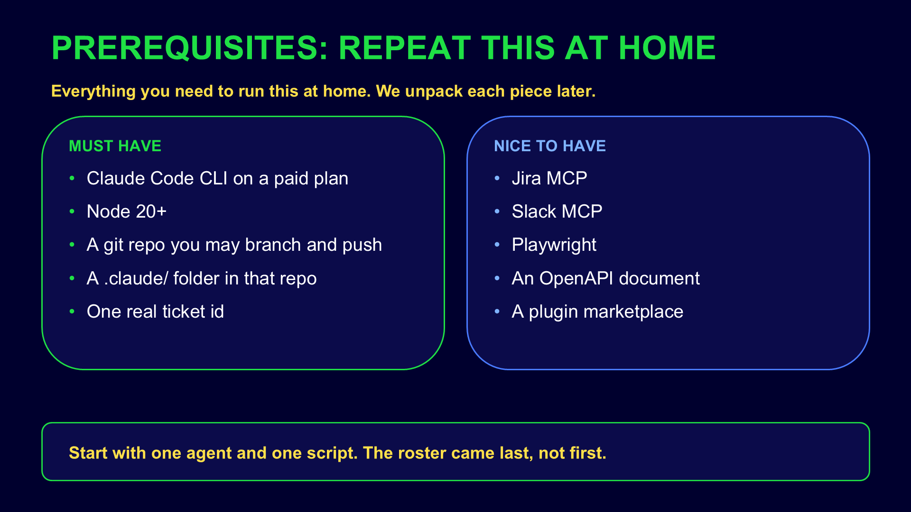
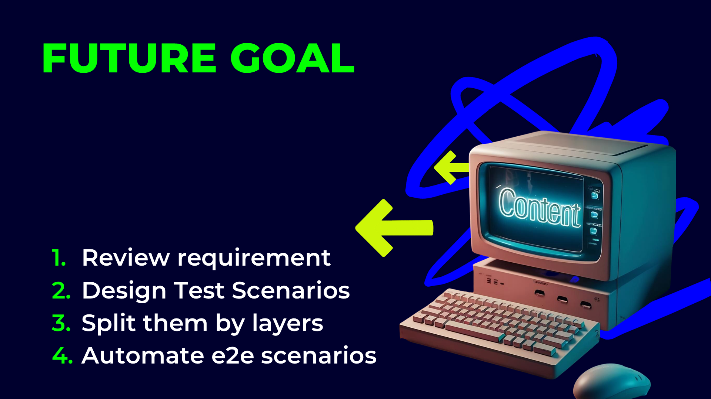

# QA workflow run — ticket to pull request in auto mode

## Presentation















```text
/qa-workflow SCRUM-115 --auto --max-review-iterations 1 --max-design-iterations 1

Run end to end in auto mode. Code review loops: one revision round max per stream
(review -> fix -> re-review); if still Needs Revision after that, escalate, don't loop.
Design review: single pass, ship open findings as approved_with_open_findings.
Finish through the ship step (qa-ship-tests -> git-workflow-orchestrator): branch,
commit, push, open PR against main. Then hand back on Jira: comment PR URL, move to In Review.
Close with node .claude/hooks/metrics-report.mjs SCRUM-<ID>.
```
