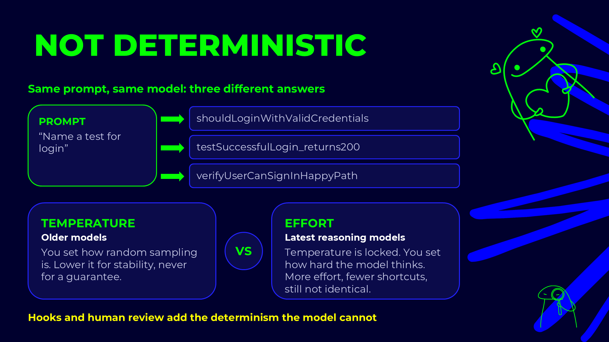
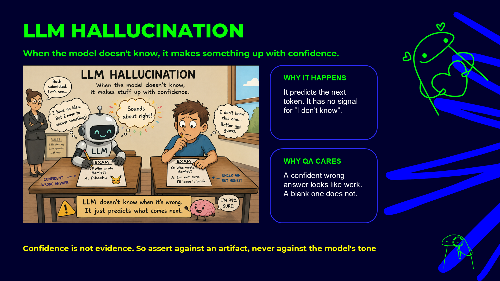
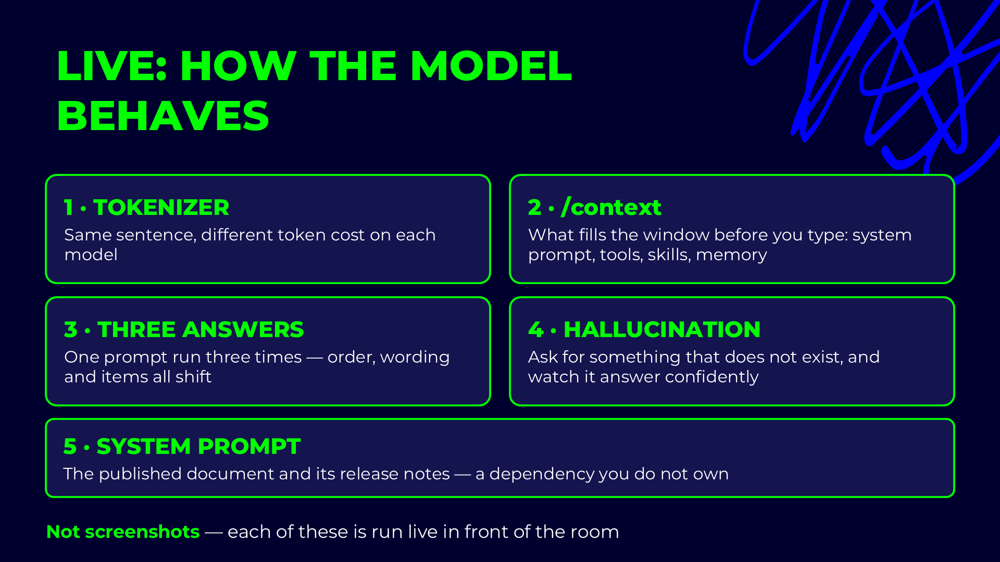

# Non-determinism and hallucination — see it live

## Slides







Two properties of every model, shown in under three minutes. Neither is a bug you can fix with a better
prompt. Both are why the workflow in this repo asserts against files and scripts rather than the
model's wording.

---

## Demo — one prompt, three answers

Open three fresh sessions (or `/clear` between runs). Paste the same prompt into each:

```text
List the top 5 characteristics of a good QA engineer. One line each, numbered, no intro.
```

Put the three answers side by side and compare:

- **What moves:** order, wording, length, and usually one or two of the items.
- **What holds:** five numbered lines, one per line, no intro.

The rules held. The text did not. So a test of an LLM output asserts the rules, never the exact text.

### Make it testable

```text
List the top 5 characteristics of a good QA engineer.
Return JSON only: {"items": [{"name": string, "why": string}]}, exactly 5 items, "why" under 15 words.
```

Now run it three times and check the shape with a script, not by eye:

```powershell
# save each answer as run1.json, run2.json, run3.json, then:
node -e "for (const f of ['run1','run2','run3']) { const j = require('./'+f+'.json'); console.log(f, j.items.length === 5 && j.items.every(i => i.why.split(' ').length < 15) ? 'PASS' : 'FAIL'); }"
```

Three different answers, three `PASS`. That is how `test-design-lint.mjs` and `spec-lint.mjs` treat
agent output in this repo: they check structure and arithmetic, never phrasing.

### Temperature and effort

- Older API models expose **temperature**. Lower it for stability, never as a guarantee.
- Current reasoning models lock temperature and expose **effort**. More effort means fewer shortcuts,
  but the answers are still not identical.
- In Claude Code: `/model` picks the model, and the effort setting controls how hard it thinks.

---

## What to point at

- **Same prompt, same model, different answer.** Hooks, scripts and human review add the determinism
  the model does not have.
- **Confidence is not evidence.** The model has no signal for "I don't know". Assert against an
  artifact, never against the tone.
- **Grounding beats instructions.** "Don't hallucinate" does little. "Quote the file you read" gives you
  something to check.
