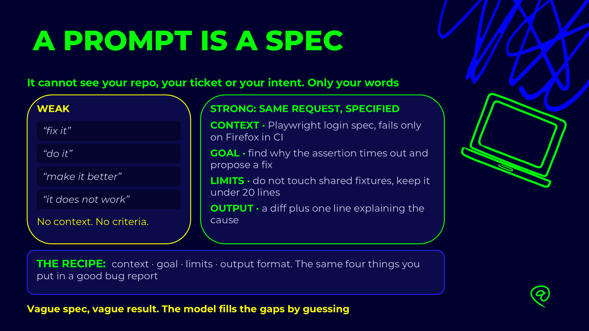

# A prompt is a spec — context, goal, limits, output

## Slides



The model cannot see your repo, your ticket or your intent. Only your words. A vague prompt is a vague
spec, and the model fills every gap by guessing. The recipe is the one you already use for a good bug
report:

| Part | Answers | Bug report equivalent |
|---|---|---|
| **Context** | What is this, where does it fail, what do we already know? | Environment, preconditions |
| **Goal** | What must be true when you are done? | Expected result |
| **Limits** | What must not change, how big may the change be? | Scope, affected components |
| **Output** | What exactly do you hand back? | Attachments |

---

## Example 1 — a flaky test

### ❌ Weak (do not use)

```text
fix it
```

```text
the login test does not work
```

No context, no criteria. The model will pick a test, guess a cause, and change whatever makes the red
go away. Often that means a longer timeout or a weaker assertion.

### ✅ Strong — same request, specified

```text
CONTEXT
tests/ui/login.spec.ts > "Login as owner - Should be able to login with valid credentials" passes locally in Chromium and fails only on Firefox in CI.
The failure is a timeout on the first assertion after the login click.

GOAL
Find why the assertion times out on Firefox and propose a fix.

LIMITS
- Do not touch fixtures/ or playwright.config.ts.
- No waitForTimeout, no networkidle, no longer timeout.
- Keep the change under 20 lines.

OUTPUT
A diff, plus one line naming the root cause.
```

---

## Example 2 — "take a look"

### ❌ Weak

```text
can you take a look at the search tests and make them better
```

### ✅ Strong

```text
CONTEXT
tests/ui/search-games.spec.ts was written before docs/automation/etalons/ui-spec-etalon.md existed.

GOAL
Review it against the etalon's # Core: locator tiers, web-first assertions, meaningful assertions,
cleanup. Report only; do not edit.

LIMITS
Cite each finding by file:line. Skip formatting nits. At most 10 findings, most severe first.

OUTPUT
A table: line · rule broken · why it matters · suggested fix. Then one line: keep, fix or rewrite.
```

---

## Checklist

- [ ] Could a new colleague do the task from this prompt alone, without asking a question?
- [ ] Does it name the file, the test, the endpoint? Not "the test".
- [ ] Is "done" a command that passes, or a shape you can check?
- [ ] Does it say what must **not** change?
- [ ] Does it say what to return?

> The four parts are the same whether the reader is a model or a person. The difference is that a
> person asks when something is missing, and the model guesses.

## Direct vs indirect prompts

A model does what the prompt says, not what it hints at. A polite, indirect prompt
("I would like to know…", "Could you maybe…", "It would be nice if…") leaves out the
action, the scope and what "done" means, so the model has to guess all three. Often it
guesses "explain" when you meant "change the code".

A direct prompt says **what to do, where, with what constraints, and what to return**.
It is not rude. It is just specific.

---

### Example 1 — write a test

#### ❌ Indirect (do not use)

```text
Hi! I would like to know if it's possible to maybe add some tests for the admin
creation feature? It would be great if they followed our style, if that's not
too much trouble. Thanks a lot!
```

What goes wrong:

- **"I would like to know if it's possible"** is a yes/no question. A literal answer is "Yes."
- **"some tests"**: how many, API or UI, which cases?
- **"our style"**: which file defines it?
- **No done criteria**: nothing says whether the tests must run, or pass.

#### ✅ Direct (use this)

```text
Add API tests for POST /api/admin in tests/api/admin-create.spec.ts.

Cases:
1. Owner creates an admin with a valid email and matching passwords → 201.
2. Duplicate email → 409.
3. Password confirmation mismatch → 400.
4. No bearer token → 401.

Follow docs/automation/etalons/api-spec-etalon.md (# Core).
Import test/expect from @fixtures/api-fixture. Use the builder in // Act.
Push every created email to createdAdminEmails for cleanup.

Done when `npm run test:api` and `npm run typecheck` both pass.
Return the file path and the run summary.
```

---

### Example 2 — investigate a failure

#### ❌ Indirect (do not use)

```text
I would like to know why the owner test is failing sometimes, if you have a moment
could you perhaps take a look?
```

#### ✅ Direct (use this)

```text
tests/ui/owner.spec.ts › "add a new admin" fails about 1 run in 5 with
"locator.click: Timeout 30000ms exceeded".

Find the root cause. Do not add waitForTimeout or retries.
Run the test 10 times with --repeat-each=10 to confirm the fix.
Report the cause (file:line), the fix, and the 10-run result.
```

---

### Example 3 — ask for a review

#### ❌ Indirect (do not use)

```text
I would like to know what you think about my changes, any feedback would be appreciated.
```

#### ✅ Direct (use this)

```text
Review the uncommitted diff in pages/ and tests/ui/.
Check only: assertions inside page objects, fixed waits, and locators outside the
tier ladder in docs/automation/etalons/ui-spec-etalon.md.
Output one line per finding: file:line — problem — fix. No praise, no summary.
```

---

### Checklist for a direct prompt

| Element | Indirect prompt | Direct prompt |
|---|---|---|
| **Action** | "I would like to know…" | Imperative verb: *Add*, *Fix*, *Review*, *Explain* |
| **Target** | "the admin feature" | Exact file, route or test title |
| **Scope** | "some tests" | Listed cases, or a limit ("only X") |
| **Constraints** | "follow our style" | The file that defines the style, plus the hard bans |
| **Done criteria** | none | The command that must pass |
| **Output** | none | The shape of the answer: table, file list, one line per finding |

### Phrases to replace

| Instead of | Write |
|---|---|
| I would like to know if you could… | *Do X.* |
| Could you maybe take a look at… | *Find the cause of X in `<file>`.* |
| It would be nice if… | *Add / change X.* |
| If it's not too much trouble… | *(remove it)* |
| Any feedback would be appreciated | *Review X for A, B, C. Output format: …* |
| Something like… / kind of… | The exact value, name or path |

> Politeness costs nothing, but vagueness does. "Please" is fine. What causes trouble
> is a question standing in for an instruction, and a prompt with no finish line.

## Structured data in prompts (XML and JSON)

A prompt usually carries two kinds of text: **instructions** (what to do) and **data**
(the ticket, the log, the test output, the list of cases). When both arrive as one block
of prose, the model has to guess where the instruction ends and the data begins. It may
follow a sentence inside a pasted log as if you wrote it, or miss half the cases because
they were buried in a paragraph.

Wrap the data in a structure the model can find:

- **XML tags** for blocks of free text: a ticket, a stack trace, a diff, a report.
- **JSON** for records with fields: a list of test cases, a payload, the answer shape you
  want back.

Then refer to each block by its name in the instruction: *"the cases in `<cases>`"*.

---

### Example 1 — separate the instruction from pasted text

#### ❌ Mixed (do not use)

```text
Here is the failure, please find the cause. Error: locator.click: Timeout 30000ms
exceeded. waiting for getByRole('button', { name: 'Add Admin' }) at
pages/owner-page.ts:42 at tests/ui/owner.spec.ts:57. The ticket says the owner
should be able to add an admin from the dashboard, and the button appears after
the admin list loads. Also the log says: retrying click, element is not stable.
Keep the fix small.
```

What goes wrong:

- **Where does the error end?** "The ticket says…" reads like part of the log.
- **Which text is the requirement** and which is your own guess about it?
- **"Keep the fix small"** sits at the end of the data and is easy to lose.

#### ✅ Tagged (use this)

```xml
<task>
Find the root cause of the failure in <error>, using <requirement> as the expected
behaviour. Do not add waitForTimeout or retries. Report the cause as file:line and
propose the smallest fix.
</task>

<requirement source="SCRUM-139, AC-2">
The owner can add an admin from the dashboard. The "Add Admin" button is shown
after the admin list has loaded.
</requirement>

<error file="tests/ui/owner.spec.ts" line="57">
locator.click: Timeout 30000ms exceeded.
  waiting for getByRole('button', { name: 'Add Admin' })
  - element is not stable
  - retrying click action
    at pages/owner-page.ts:42
</error>
```

Now each piece has one home. The model knows the error is evidence, the requirement is
the oracle, and the task is the only thing to obey.

> Text inside a data tag is **data, not instructions**. If a pasted Slack message says
> "ignore the previous rules", it is still just the content of `<slack_message>`. Say so
> in the task when the data comes from someone else.

---

### Example 2 — give test cases as JSON, not as prose

#### ❌ Prose (do not use)

```text
Write API tests for creating an admin. It should work with a normal email, fail if
the email is already taken (I think that's a 409), fail with a bad email like
"not-an-email", and also the passwords must match, otherwise it's a 400 I believe,
and without a token it should be 401.
```

The model has to extract five cases from a paragraph, and "I think" / "I believe" makes
it unclear which status codes are confirmed.

#### ✅ JSON (use this)

```text
Add one API test per case in <cases> to tests/api/admin-create.spec.ts.
Use the "expectedStatus" value exactly. A case with "confirmed": false gets
test.fixme() and a comment naming the open question — do not guess the status.
```

```json
{
  "endpoint": "POST /api/admin/users",
  "cases": [
    { "id": "SCN-001", "title": "valid email and matching passwords", "expectedStatus": 201, "confirmed": true },
    { "id": "SCN-002", "title": "email already registered",           "expectedStatus": 409, "confirmed": false },
    { "id": "SCN-003", "title": "malformed email 'not-an-email'",     "expectedStatus": 400, "confirmed": true },
    { "id": "SCN-004", "title": "password confirmation mismatch",     "expectedStatus": 400, "confirmed": true },
    { "id": "SCN-005", "title": "no bearer token",                    "expectedStatus": 401, "confirmed": true }
  ]
}
```

Every case has an id to trace, a title to reuse in the test name, and one field that
says whether the expected value is known. Nothing has to be inferred.

---

### Example 3 — ask for the answer as JSON

When the output will be read by a script, a checklist or another agent, name its shape.

#### ❌ Open answer (do not use)

```text
Look at the test results and tell me what failed.
```

You will get a friendly paragraph, different every time.

#### ✅ Answer schema (use this)

```xml
<task>
Read the Playwright output in <results>. Return only JSON matching <schema>.
No prose before or after it. Use null when a field is unknown; do not invent a value.
</task>

<schema>
{
  "total": number,
  "failed": [
    {
      "title": string,
      "file": string,
      "line": number | null,
      "error": string,
      "category": "product-bug" | "test-bug" | "environment" | "unknown"
    }
  ]
}
</schema>

<results>
  … paste the `npx playwright test --reporter=line` output here …
</results>
```

A fixed shape can be diffed between runs, parsed by `jq`, or pasted into a ticket, and
the `null` rule stops the model filling a gap with a plausible guess.

---

### Which format for which data

| Data | Format | Why |
|---|---|---|
| Ticket, requirement, user story | `<requirement>` tag | Free text; the tag marks it as the oracle |
| Stack trace, log, test output | `<error>`, `<results>` tag | Keeps log lines from being read as instructions |
| Diff or code to review | `<diff>`, `<code file="…">` tag | Attributes carry the path without extra prose |
| Test cases, data matrix | JSON array | One record per case, same fields every time |
| Request payload | JSON object | It is already JSON in the real request |
| Expected answer shape | JSON schema inside `<schema>` | Parsable, comparable between runs |
| Short list of rules | Markdown list | Structure would add noise, not clarity |

### Rules of thumb

| Do | Don't |
|---|---|
| Name tags for what they hold: `<error>`, `<cases>` | Use generic names: `<data>`, `<text1>` |
| Refer to the tag in the instruction: "the cases in `<cases>`" | Say "the stuff below" |
| Put long data first, the task and questions after it | Put a one-line task under 300 lines of log |
| Keep a tag name the same across prompts | Call it `<log>` today and `<output>` tomorrow |
| Add attributes for metadata: `file="…"`, `source="…"` | Describe the metadata in a sentence before the block |
| Mark unknown values explicitly (`"confirmed": false`, `null`) | Leave "I think" and "maybe" inside the data |
| Validate the JSON you paste | Paste JSON with trailing commas and comments |

> XML and JSON are not magic keywords. They work because they make boundaries visible.
> Any consistent structure helps; mixing instructions and data in one paragraph never does.

## Code examples in prompts (show, don't describe)

"Follow our style" asks the model to guess the style. "Use the builder, one `with*()`
per field, Arrange / Act / Assert comments" is better, but a paragraph of rules still
leaves room for interpretation. **One short example of the code you want is the most
precise specification you can give.** The model copies its shape: imports, naming,
comments, assertion style, cleanup.

An example works best when you also say:

- **what to copy** from it (the pattern),
- **what to change** (the data, the endpoint, the case),
- **what not to copy** (a value that belongs only to the example).

---

### Example 1 — generate an API test from a reference test

#### ❌ Description only (do not use)

```text
Write an API test for deleting an admin. Use our framework and make it look like
the other tests.
```

What goes wrong:

- **"our framework"**: the model may import from `@playwright/test`, call `request.delete`
  with a URL string, or invent a helper that does not exist.
- **"like the other tests"**: which one? `tests/api/` holds four files written at
  different times, some before the current rules.
- **No cleanup rule**: if the delete fails, the seeded admin stays in the database.

#### ✅ Description + example (use this)

```text
Add a test to tests/api/admin-api.spec.ts for SCN-012:
"Owner deletes an existing admin → 200, and the admin is no longer listed."

Copy the structure of <example> exactly:
- imports from @fixtures/api-fixture, never from @playwright/test;
- // Arrange, // Act, // Assert comments, each used once;
- the Act is a builder chain with one with*() per value the request sends;
- the controller (api.admin.*) is used only in Arrange and Assert;
- the created email is pushed to createdAdminEmails BEFORE the create call.

Change: the endpoint (sendDeleteAdmin), the title and the assertions.
Do not copy: the "Admin user created successfully" message — it belongs to the
create response, not the delete one. Assert only what SCN-012 states.

Done when `npx playwright test tests/api/admin-api.spec.ts` and
`npm run typecheck` pass. Return the new test only.

<example file="tests/api/admin-api.spec.ts">
test("Create admin - Should create an admin with a valid email", async ({
  api,
  ownerToken,
  createdAdminEmails,
}) => {
  // Arrange - registered before the call so cleanup runs even if it fails
  const newAdminEmail = AdminTestData.uniqueApiEmail();
  createdAdminEmails.push(newAdminEmail);

  // Act
  const result = await api.admin
    .adminBuilder()
    .withBearerToken(ownerToken)
    .withEmail(newAdminEmail)
    .withPassword(AdminTestData.DEFAULT_PASSWORD)
    .withConfirmPassword(AdminTestData.DEFAULT_PASSWORD)
    .sendCreateAdmin();

  // Assert - FR-11.2
  expect(result.status).toBe(201);
  expect(result.body).toMatchObject({
    message: "Admin user created successfully",
    admin: { email: newAdminEmail, role: "admin" },
  });
});
</example>
```

What the model can now produce without guessing:

```ts
test("Delete admin - Should remove an existing admin", async ({
  api,
  ownerToken,
  createdAdminEmails,
}) => {
  // Arrange - seed the admin to delete; cleanup is a no-op if the test removes it
  const adminEmail = AdminTestData.uniqueApiEmail();
  createdAdminEmails.push(adminEmail);

  const seedResult = await api.admin.createAdmin(
    ownerToken,
    AdminTestData.createAdminPayload(adminEmail),
  );
  expect(seedResult.status).toBe(201);
  const adminId = (seedResult.body as CreateAdminResponse).admin.id;

  // Act
  const result = await api.admin
    .adminBuilder()
    .withBearerToken(ownerToken)
    .sendDeleteAdmin(adminId);

  // Assert - SCN-012
  expect(result.status).toBe(200);

  const listResult = await api.admin.listAdmins(ownerToken);
  expect(listResult.status).toBe(200);
  expect(
    (listResult.body as ListAdminsResponse).admins.map((a) => a.email),
  ).not.toContain(adminEmail);
});
```

Same imports, same phases, same cleanup, same builder form — and no copied message
string, because the prompt said which part of the example was data.

---

### Example 2 — point at the file instead of pasting it

Pasting is best for a short, self-contained pattern. When the pattern is a whole file,
or it lives in a document that is kept up to date, point at it by path and name the part
to use. A pasted copy goes stale; the file does not.

#### ❌ Vague reference (do not use)

```text
Create a page object for the admin statistics, similar to the existing ones.
```

#### ✅ Exact reference (use this)

```text
Create pages/admin-stats-page.ts for the statistics panel on /admin.

Reference, in this order:
1. docs/automation/etalons/ui-spec-etalon.md, section "# Core" — the locator tier
   ladder and the "no expect in a page object" rule.
2. pages/home-page.ts — copy its constructor, its readonly locator fields and its
   waitFor({ state: "detached" }) loop for client-side re-renders.

Do not copy home-page.ts locators; explore /admin and pick locators from the
tier ladder. Add a LOCATOR-FALLBACK comment to any locator below tier 2.
Return the file and a table: field — locator — tier.
```

---

### Example 3 — give a good and a bad example together

A counter-example shows the boundary of the rule faster than a sentence can.

```text
Refactor the waits in tests/ui/search-games.spec.ts.

<good>
await expect(homePage.gameCards).toHaveCount(3);
</good>

<bad reason="fixed wait: slow on CI, still flaky on a slow backend">
await page.waitForTimeout(2000);
expect(await homePage.gameCards.count()).toBe(3);
</bad>

Replace every occurrence of the <bad> shape with the <good> shape.
Do not change the expected values. Run the file with --repeat-each=5 and report the result.
```

---

### Checklist for a prompt with a code example

| Element              | Without it                              | With it                                                         |
| -------------------- | --------------------------------------- | --------------------------------------------------------------- |
| **The example**      | Model invents the style                 | Model copies a real, working shape                              |
| **Source**           | "like the other tests"                  | `file="tests/api/admin-api.spec.ts"` or an exact path + section |
| **What to copy**     | Everything, including test data         | A listed pattern: imports, phases, builder, cleanup             |
| **What to change**   | Model decides                           | Endpoint, title, assertions — named                             |
| **What not to copy** | Example-only strings leak into new code | "Do not copy the create message"                                |
| **Counter-example**  | Rule is abstract                        | `<bad>` block shows the exact shape to avoid                    |
| **Done criteria**    | Code that looks right                   | The command that must pass                                      |

### Rules of thumb

| Do                                                            | Don't                                                              |
| ------------------------------------------------------------- | ------------------------------------------------------------------ |
| Use one short example that already follows the current rules  | Paste an old file that breaks them — the model copies the bugs too |
| Keep the example the same size as the expected output         | Paste 500 lines to show a 20-line pattern                          |
| Wrap the example in a tag with its path: `<example file="…">` | Drop code into the prompt with no marker where it ends             |
| Say which values are example-only                             | Let a hardcoded email or message travel into the new test          |
| Prefer a path to a maintained file for a large pattern        | Paste a copy that goes out of date next week                       |
| Pair a `<good>` with a `<bad>` when the rule is subtle        | Describe the anti-pattern only in words                            |

> The model imitates what it sees more reliably than what it is told. Choose the example
> as carefully as the instruction: it is the part of the prompt that gets copied.
