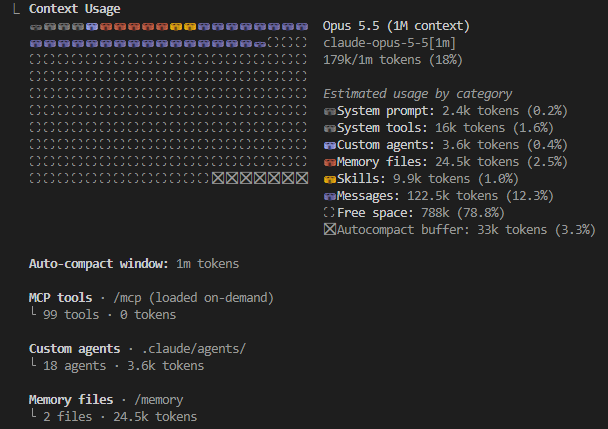

# The context window — what the model can see right now

## Slides


The context window is everything the model reads on one call: the rules it was given, the tools it can
use, your project memory, and the whole conversation so far. It has no other memory. What is not in the
window does not exist for the model, and everything in the window is sent again **on every call**.

```text
/context
```



## How big is 200k or 1M tokens?

For English prose, 1 token ≈ 0.75 words. So 200k tokens ≈ 150,000 words, about 500 pages.

| Book | Words | ≈ Tokens | Fits in 200k? |
|---|---|---|---|
| The Hobbit | ~95,000 | ~127k | yes |
| The Two Towers | ~143,000 | ~191k | just about |
| Harry Potter and the Half-Blood Prince | ~169,000 | ~225k | no |
| The Fellowship of the Ring | ~177,000–188,000 (sources differ) | ~240k–250k | no |
| The Hobbit + all of The Lord of the Rings | ~575,000–645,000 | ~770k–860k | fits in 1M |

These are rough numbers. Code, JSON, logs and non-English text take more tokens per word (Ukrainian costs
noticeably more than English), and every tokenizer splits text differently.

## What each category means

| Category | What it is | Who controls it |
|---|---|---|
| **System prompt** | Claude Code's own instructions: identity, tone, how to use tools, safety rules. | Anthropic. Changes with releases. |
| **System tools** | The definitions of `Read`, `Edit`, `Bash`, `Grep`, `Agent`… The model has to read *how* to call a tool before it can call it. | Claude Code. Rarely-used tools are deferred and loaded on demand. |
| **MCP tools** | The tools of your MCP servers. Here: 99 tools, **0 tokens**, because they are loaded on demand, only when needed. | You, through `/mcp` and `.mcp.json`. |
| **Custom agents** | One short line per sub-agent: its name and description, so the model knows whom it can delegate to. The agent's full body is **not** here. It loads only in the agent's own window. | You, `.claude/agents/`. |
| **Memory files** | `CLAUDE.md` files, loaded in full at the start of every session. | You. The biggest lever you have. |
| **Skills** | Only each skill's name and description. The body loads when the skill fires. | You, `.claude/skills/`, plugins. |
| **Messages** | The conversation: your prompts, the model's answers, and every tool result (every file read, every test log). This grows fastest. | The work itself. |
| **Free space** | What is left for the rest of the task. | — |
| **Autocompact buffer** | A reserve kept free so Claude Code can summarise the conversation when the window fills up, instead of failing. | Claude Code. |

## When each category enters the window

Some parts are loaded once, at session start, and then paid on every call. Others arrive only when
they're needed. That's the difference between a fixed cost and a cost you control.

| Category | Loaded at session start | Loaded later, on demand |
|---|---|---|
| **System prompt** | Always, in full. | — |
| **System tools** | Definitions of the core tools. | Rarely-used tools: only when the model looks them up. |
| **MCP tools** | Only the tool names. | The full definition when the model first needs that tool. Its **result** lands in Messages when it's called. |
| **Custom agents** | Name + description of each agent. | The agent's body: when it is spawned, and in **its own** window, not yours. |
| **Memory files** | `~/.claude/CLAUDE.md` and the project `CLAUDE.md`, in full. | A `CLAUDE.md` in a subfolder: when Claude reads files in that folder. |
| **Skills** | Name + description of each skill. | `SKILL.md` body: when you type `/skill-name` or the model picks it. `references/`: only when the skill reads them. `scripts/`: run outside the window. Only their output comes in. |
| **Messages** | Empty. | Every prompt, answer and tool result, as it happens. |
| **Autocompact buffer** | Reserved from the start. | Used when the window fills up: the conversation is replaced by a summary. |

Rule of thumb: **session start = fixed tax on every call, on demand = pay only when used.** Anything that is
needed only sometimes belongs in the second column.

**Read the screenshot:** the memory file (this repo's `CLAUDE.md`, 24.5k) costs more than every tool
definition combined, and it's paid on every call in every session. That's why the house rules for tests
moved out of it into the etalons, which are read only when needed.

## Each agent has its own window

A sub-agent does not share the main conversation. It starts with an empty window of its own. It gets its
own system prompt (the agent file body), only the tools it was granted, and the task it was handed. Only
its final answer comes back to the main thread.

- **The sizes can differ.** The window depends on the model the agent runs on. A `model: haiku` agent
  gets a 200k window even when the main session runs Opus with 1M.
- **That's the point of delegation.** A reviewer that reads twenty files fills *its own* window, not
  yours. It is also why agents in this repo pass file paths to each other, never chat logs.
- **The agent knows only what it was told.** Anything not in its prompt or on disk is invisible to it.

## Lost in the middle

A bigger window is not the same as better attention. Research ([Liu et al., 2023, *Lost in the
Middle*](https://arxiv.org/abs/2307.03172)) showed that models find information best when it is at the
**beginning** or the **end** of the context, and worst when it is buried in the **middle**. Newer models
are better at this, but the pattern hasn't gone away.

What to do about it:

- Put the important instruction at the **end** of a long prompt, after the pasted log or ticket, not
  before it.
- Don't paste five files "just in case". Every extra file pushes the one that matters towards the middle.
- Long sessions degrade. The rule you gave an hour ago is now in the middle.

## Keep it clean

| Situation | Do |
|---|---|
| Switching to an unrelated task | `/clear` — start fresh. |
| Long task, early details still matter | `/compact keep the failing test names` |
| A job that reads a lot and returns a little | Delegate it to a sub-agent. |
| A rule you repeat every session | Put it in `CLAUDE.md`, but keep that file short. |
| Knowledge needed only sometimes | A skill or a doc read on demand, not `CLAUDE.md`. |

## What to point at

- **Full window, higher bill.** Every call re-sends the whole window. In this repo's cost table, 96% of the
  spend was re-reading context (cache reads), not writing output.
- **Full window, worse answers.** More text means more noise, and more things lost in the middle.
- **Nothing persists.** Memory is something you build: `CLAUDE.md`, files on disk, a state file.
