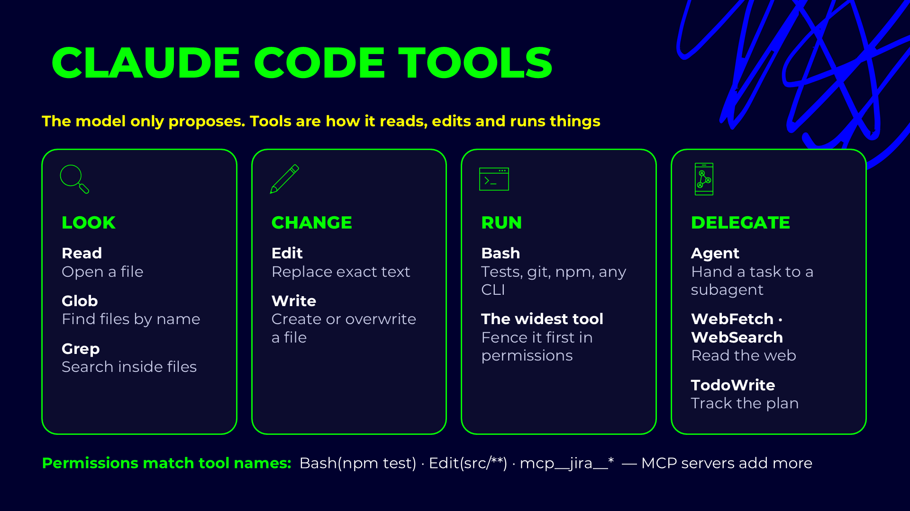

# Claude Code built-in tools

## Slides

Tools are the actions Claude can take on its own: open a file, search the code, edit it, run a command,
hand work to a subagent. You don't call them yourself. Claude picks one per step, and each call is shown
in the transcript, so you can see exactly what it did. Permissions decide which tools run without asking
(`/permissions`), and every skill or subagent can be limited to a subset of them in its `tools:` list.

## Look

| Tool | What it does | Example |
|---|---|---|
| `Read` | Opens a file. | Read `tests/ui/owner.spec.ts` before changing it. |
| `Glob` | Finds files by name. | `tests/**/*.spec.ts`: every spec in the suite. |
| `Grep` | Searches inside files. | Every place that still calls `waitForTimeout`. |

## Change

| Tool | What it does | Example |
|---|---|---|
| `Edit` | Replaces exact text in an existing file. | Swap one flaky locator for a `getByRole` one. |
| `Write` | Creates a file, or overwrites one completely. | A new page object under `pages/`. |

## Run

| Tool | What it does | Example |
|---|---|---|
| `Bash` | Runs tests, git, npm or any command-line tool. | `npx playwright test tests/ui/owner.spec.ts` |

`Bash` is the widest tool: anything the shell can do, it can do. Restrict it first in permissions, e.g.
allow `npx playwright test` and keep `git push` behind approval.

## Delegate

| Tool | What it does | Example |
|---|---|---|
| `Agent` | Hands a task to a subagent with its own context. | A reviewer subagent checks the new tests. |
| `WebFetch` · `WebSearch` | Reads the web. | Look up the Playwright release notes before an upgrade. |
| `TodoWrite` | Tracks the plan as a checklist. | A five-step refactor, ticked off one step at a time. |
