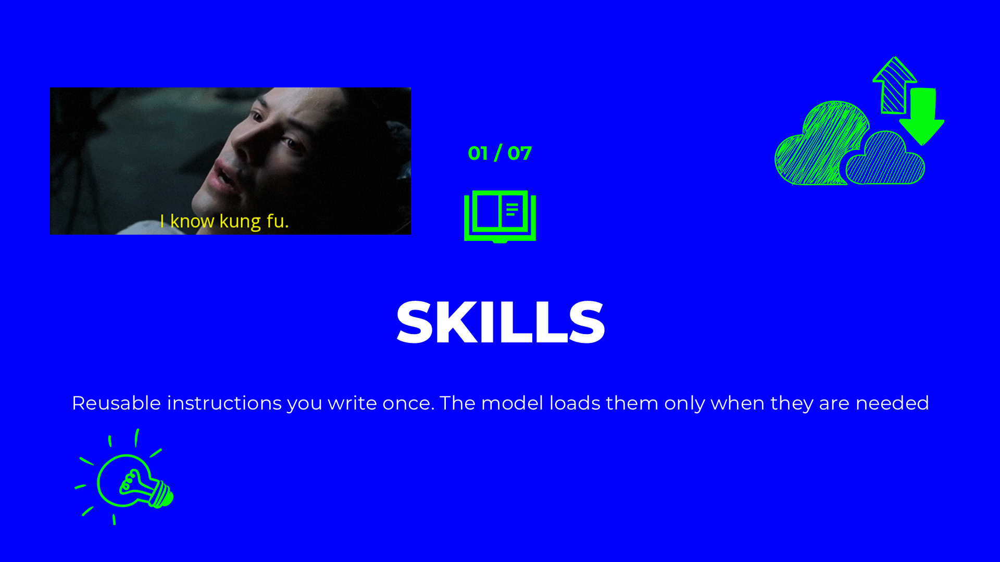
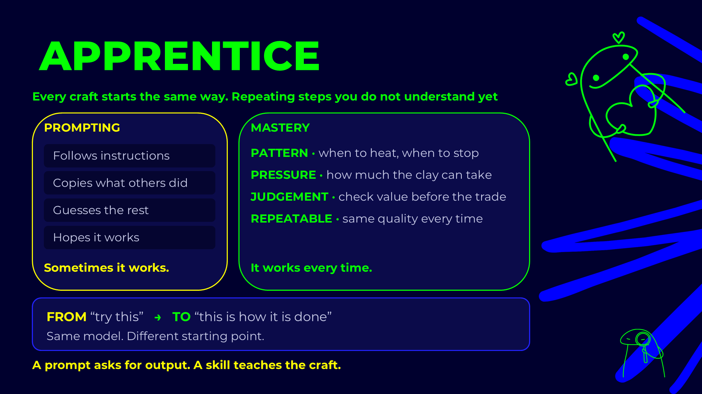
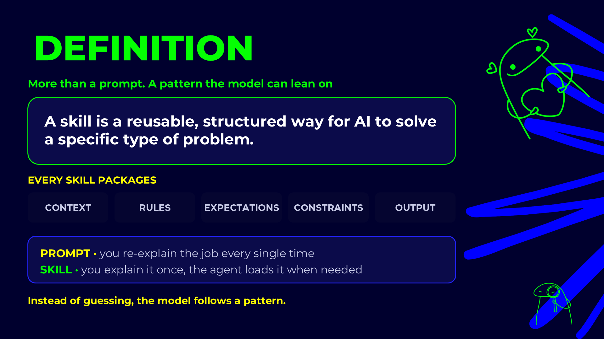
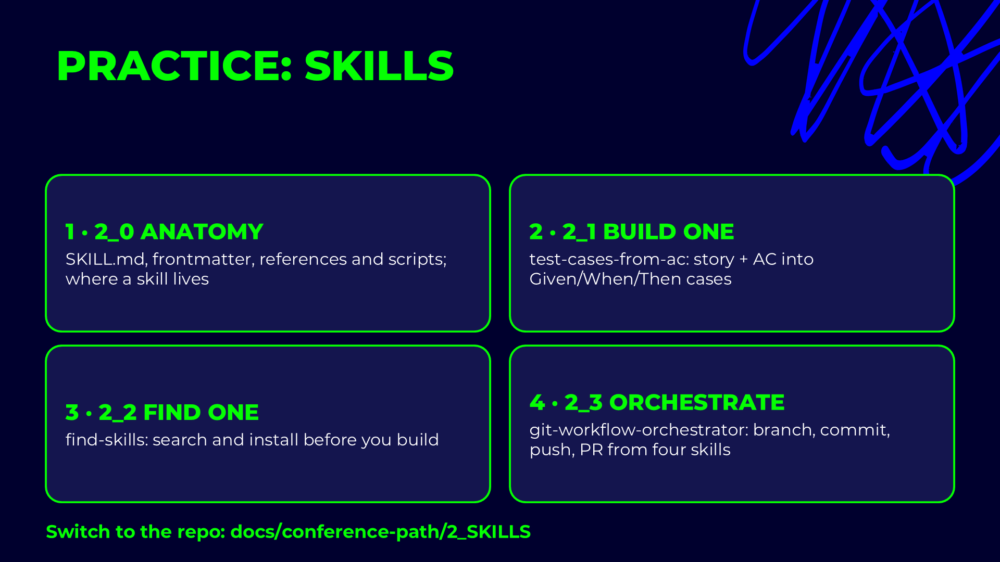
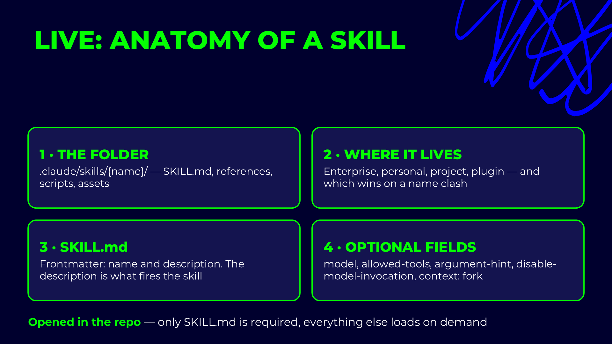

# Claude Code skills

## Presentation









## Live demo slides



A skill is a folder with instructions Claude loads only when they are needed. At startup Claude sees just
each skill's `name` and `description`; the full `SKILL.md` is read when a request matches the description,
or when you type `/<skill-name>`. That is what lets a project carry twenty skills without paying for
them in every prompt. A skill runs in the main conversation, with its tools and your permissions, and
is the right shape for a repeatable procedure: filing a bug, shipping a PR, writing a user guide.

## Architecture

```text
.claude/skills/jira-bug-creator/
├── SKILL.md                    required: frontmatter + instructions
├── references/
│   └── field-reference.md      read only at the step that needs it
├── scripts/
│   ├── draft-bug.js            run, not read: deterministic work
│   └── bug.test.js
└── assets/
    └── bug-description.template.md   templates the output is built from
```

| Part | Loaded when | Use it for |
|---|---|---|
| `name` + `description` | Always, at startup | Deciding whether the skill applies. |
| `SKILL.md` body | When the skill is triggered | The procedure: steps, rules, output format. |
| `references/` | When a step says `Read references/…` | Long detail only some runs need. |
| `scripts/` | When a step runs them | Anything that must be exact: parsing, counting, rendering. |
| `assets/` | When the output is built | Templates, sample files. |

Three levels of loading: metadata, body, files. Keep `SKILL.md` short and move the rest down a level.

Where a skill lives decides who gets it:

| Location | Available |
|---|---|
| `~/.claude/skills/<name>/` | You, in every project. |
| `.claude/skills/<name>/` | Everyone who works in this repository. |
| a plugin's `skills/` folder | Everyone who installs the plugin. |

## Frontmatter fields

```markdown
---
name: jira-bug-creator
description: File a well-formed bug in the SCRUM Jira project from a failed Playwright test
  or a plain description. Use when asked to "create a jira bug", "file this failure" or
  "log this defect".
argument-hint: "<failed test | description>"
allowed-tools: Read, Bash(node:*), mcp__atlassian__createJiraIssue
---
```

| Field | Required | What it does |
|---|---|---|
| `name` | yes | The id and the slash command: `/jira-bug-creator`. Lowercase, hyphens. |
| `description` | yes | What the skill does **and when to use it**. This is the trigger, so list the phrases people actually say. |
| `argument-hint` | no | Shown after `/name` in the command menu, e.g. `<TICKET-ID> [--auto]`. |
| `allowed-tools` | no | Tools the skill may use without a permission prompt while it runs. |
| `disable-model-invocation` | no | `true`: only you can start it with `/name`; Claude never picks it on its own. |
| `model` | no | Runs the skill on a specific model. |

The description does most of the work. A skill with a vague description is never triggered; one with a
greedy description is triggered for everything.
