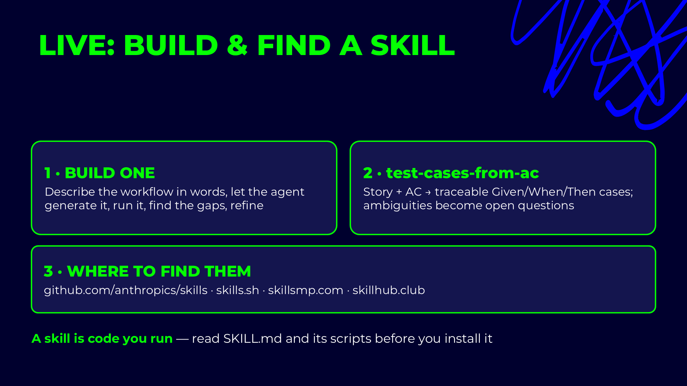

# Find skills — reuse before you build

## Slides




Before writing a skill, check whether someone already published one. `find-skills` searches the open
skills ecosystem and installs what you pick. The directories behind it are also browsable by hand:
`skills.sh`, `skillsmp.com`, `skillhub.club`, and the official set at `github.com/anthropics/skills`.

## A. Search

```text
/find-skills is there a skill that turns a Playwright HTML report into a flaky-test summary?
```

```text
/find-skills I need a skill that reviews API tests against an OpenAPI spec. Show me the top 3 with
their source repo, and do not install anything yet.
```

## B. Read before you install

A skill is code you run. Before installing, open the candidate's `SKILL.md` and its `scripts/`:

```text
Open the SKILL.md of the second result and list every script it runs, every tool it asks for in
allowed-tools, and every URL it contacts. Flag anything that writes outside the project.
```

Then run this repo's own checker on it once it is on disk:

```text
/skill-validator check <skill-name>
```

## C. Install and confirm

```text
/find-skills install the second one into this project.
```

```text
/skills
```

The new skill is listed. Its `description` decides when it fires, so read that line: a weak one means
the skill never loads.

## What to point at

- **Steal the structure, not the specifics.** Gates, `Must not` lists and scripts are the parts worth
  copying. The domain rules are yours.
- **`allowed-tools` pre-approves, it does not restrict.** A skill that pre-approves `Bash(*)` runs any
  command without asking.
- **Personal vs project.** Install experiments into `~/.claude/skills/`, and commit to `.claude/skills/`
  only what the team should get.
