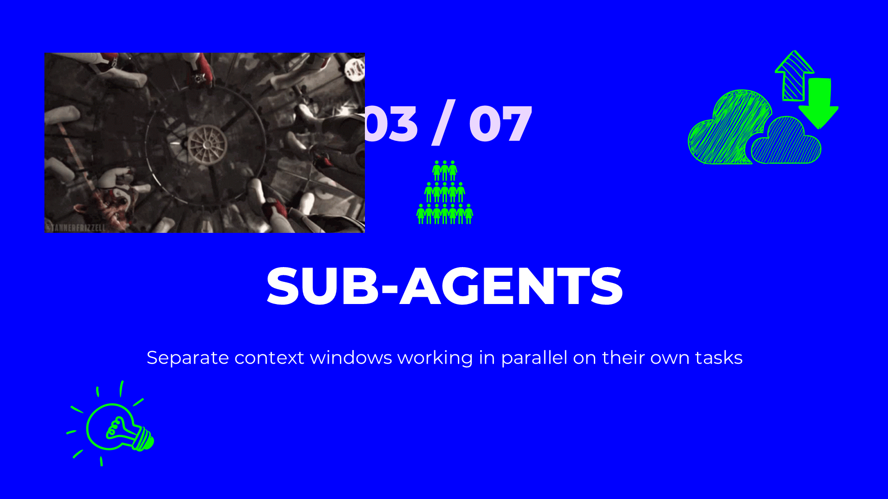
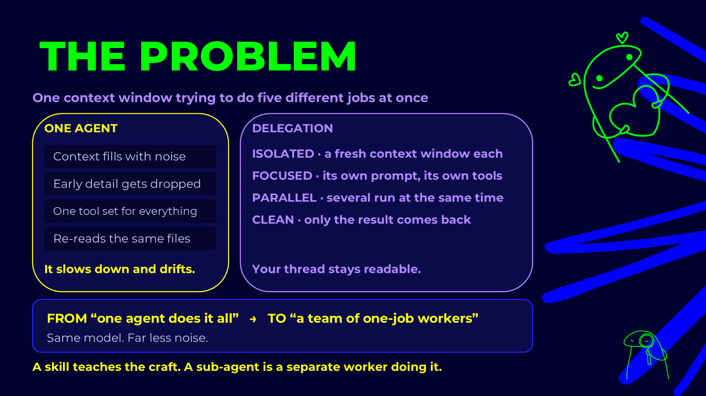
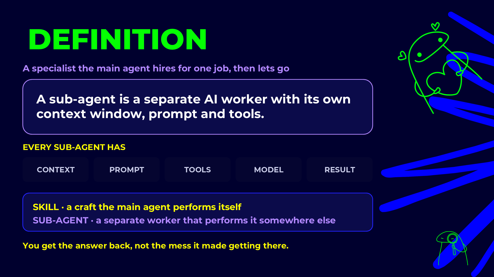
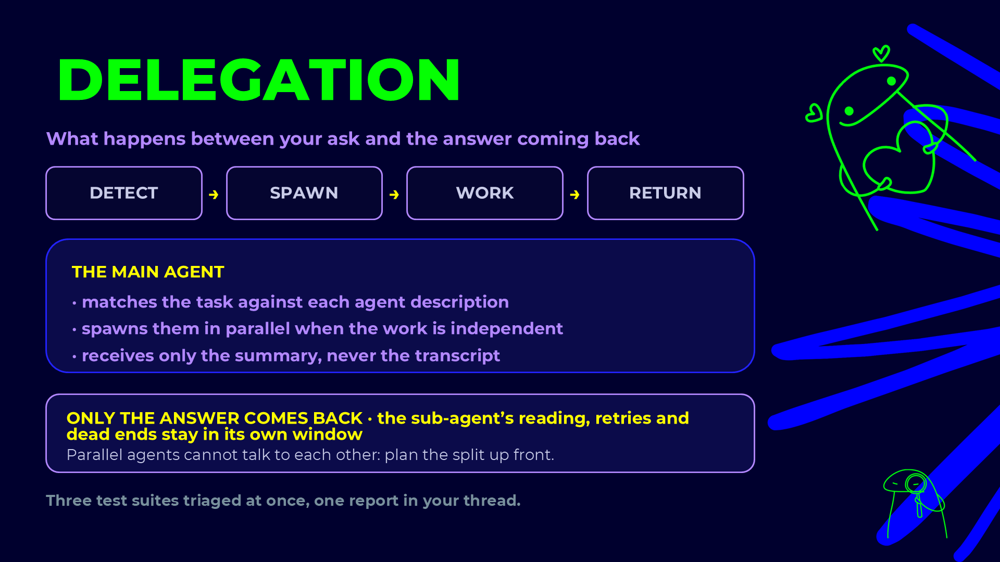
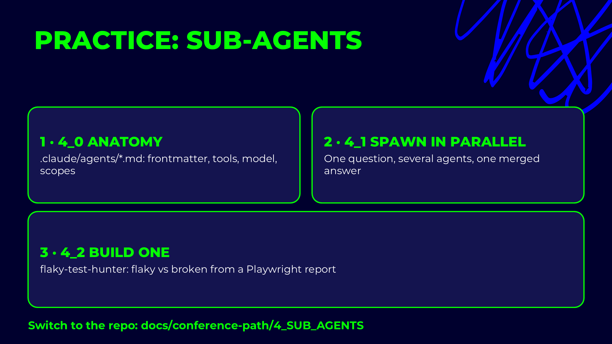
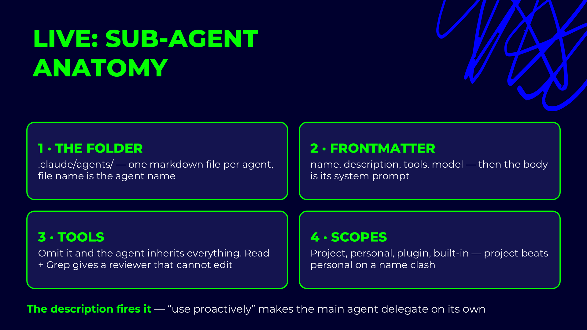

# Claude Code sub-agents

## Presentation











## Live demo slides



A sub-agent is a specialist Claude hands a task to through the `Agent` tool. It starts with a clean
context of its own, works with only the tools it was given, and returns one final message. Everything it
read along the way stays in its context, not yours. Use one when a task reads a lot to produce a little
(a code review, a search across the repo), when it should run in parallel with other work, or when it
must be limited: a reviewer that cannot edit, a Jira agent that cannot touch files.

## Architecture

```text
main conversation
   │  Agent(subagent_type: "aqa-api-test-reviewer", prompt: "...")
   ▼
sub-agent: own context window, own system prompt (the .md body), own tool list
   │  Read, Grep, Bash … (only what `tools:` allows)
   ▼
one final message back to the main conversation
```

| Property | What it means in practice |
|---|---|
| Own context | The main conversation doesn't fill up with the files the agent read. |
| Only the prompt goes in | It does not see your conversation. Everything it needs goes in the delegation prompt. |
| Only the result comes out | Ask for a short, fixed-shape answer, because that's all you get back. |
| No nesting | A sub-agent cannot start another sub-agent or use skills. Orchestration stays in the main thread. |

Where an agent lives decides who gets it:

| Location | Available |
|---|---|
| `~/.claude/agents/<name>.md` | You, in every project. |
| `.claude/agents/<name>.md` | Everyone who works in this repository. |
| a plugin's `agents/` folder | Everyone who installs the plugin. |

`/agents` creates, edits and lists them.

## File and frontmatter fields

One Markdown file: frontmatter, then the body, which becomes the agent's system prompt.

```markdown
---
name: aqa-api-test-reviewer
description: Reviews new Playwright API tests against the test design and the house style,
  re-runs the API suite and returns a Pass / Needs Revision / Blocked verdict. Use when an
  API implementation report exists and the code needs a quality gate before the PR.
tools: Read, Grep, Glob, Bash
model: opus
color: orange
---

You are a Senior QA Automation Engineer reviewing Playwright API tests.

## Process
1. ...
```

| Field | Required | What it does |
|---|---|---|
| `name` | yes | The id used to call it: `subagent_type: "aqa-api-test-reviewer"`. Lowercase, hyphens. |
| `description` | yes | What it does and **when to use it**. Claude reads this to decide when to delegate. |
| `tools` | no | Allow-list of tools. Leave it out and the agent inherits all of them, MCP tools included. |
| `model` | no | `sonnet`, `opus`, `haiku`, or `inherit` to use the main conversation's model. |
| `color` | no | Colour of the agent's label in the terminal, useful when several run in parallel. |

`tools` is the field that matters most. This reviewer has no `Edit` or `Write` on purpose: a reviewer
that can fix what it finds returns `Pass`, and the finding disappears.

## Skill or sub-agent?

| | Skill | Sub-agent |
|---|---|---|
| Runs in | the main conversation | its own context |
| Sees your conversation | yes | no, only its prompt |
| Tools | yours | its own `tools:` list |
| Good for | a procedure you follow with the user | a self-contained task that returns one answer |
