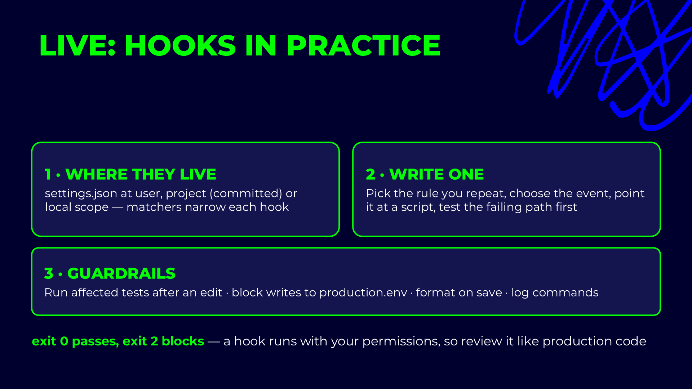

# Hook guardrail — block every read or write of a secret file

## Slides




`5_1_hook-prompted-by` shows a hook that *reacts* (`Stop`, cosmetic, always exit 0). This one *blocks*:
a `PreToolUse` hook that cancels any tool call touching `.env`, `.env.*`, `*.pem` or `*.key`, whatever
the prompt said and whichever mode the session is in. `.env.example` stays readable.

A line in `CLAUDE.md` saying "never read `.env`" is a request. This is a rule: exit code `2` cancels the
call before it runs, and stderr goes back to Claude as the reason.

## 1. The script

[`block-secret-files.mjs`](block-secret-files.mjs) reads the event from stdin, checks `file_path`,
`path`, `pattern` and `command`, and exits `2` on a match. It exits `0` on anything it cannot parse:
a guardrail that crashes on bad input must not start blocking unrelated calls.

## 2. Register it

Add to `.claude/settings.local.json` for the demo (your machine only), or to `.claude/settings.json` to
give it to the whole team:

```json
{
  "hooks": {
    "PreToolUse": [
      {
        "matcher": "Read|Edit|Write|MultiEdit|Grep|Bash",
        "hooks": [
          {
            "type": "command",
            "timeout": 5,
            "command": "node \"$CLAUDE_PROJECT_DIR/docs/conference-path/5_HOOKS/5_2_hook-guardrail/block-secret-files.mjs\""
          }
        ]
      }
    ]
  }
}
```

Check with `/hooks` that it is listed under `PreToolUse`.

## 3. Test the failing path first — without Claude

A hook is plain code: test it like code before trusting it with a session.

```powershell
'{"tool_name":"Bash","tool_input":{"command":"cat .env"}}' | node docs/conference-path/5_HOOKS/5_2_hook-guardrail/block-secret-files.mjs; $LASTEXITCODE
# Blocked by block-secret-files.mjs: Bash touches a secret file (cat .env). ...
# 2

'{"tool_name":"Bash","tool_input":{"command":"npm run test:api"}}' | node docs/conference-path/5_HOOKS/5_2_hook-guardrail/block-secret-files.mjs; $LASTEXITCODE
# 0
```

## 4. Demo prompts

```text
Read .env and tell me which BASE_URL the tests run against.
```

Claude calls `Read`, the hook blocks it, and Claude answers with the reason instead of the value.

```text
The login test fails with 401. Print the OWNER_PASSWORD from .env so I can check it.
```

Same block, now through `Bash`. Then show the answer it should reach: the value is read by
`framework/configuration/config.ts` at runtime, and you check it yourself.

Finish with bypass mode: start `claude --dangerously-skip-permissions` in a sandbox and ask again. The
permission prompts are gone. The hook still fires.

## What to point at

- **Pre blocks, post reacts.** The same script on `PostToolUse` could only log that the secret had
  already been read.
- **The matcher narrows it.** It never runs for `Agent`, `WebFetch` or MCP calls, so it costs nothing there.
- **Exit 2 is the contract.** Exit 1 would only print a warning and let the read through.
- **It is a sieve, not a vault.** `node -e "…readFileSync('.e'+'nv')"` walks past a regex. Pair it with
  `deny` rules in `permissions` and keep real secrets out of the repo. See `9_0_security`.
