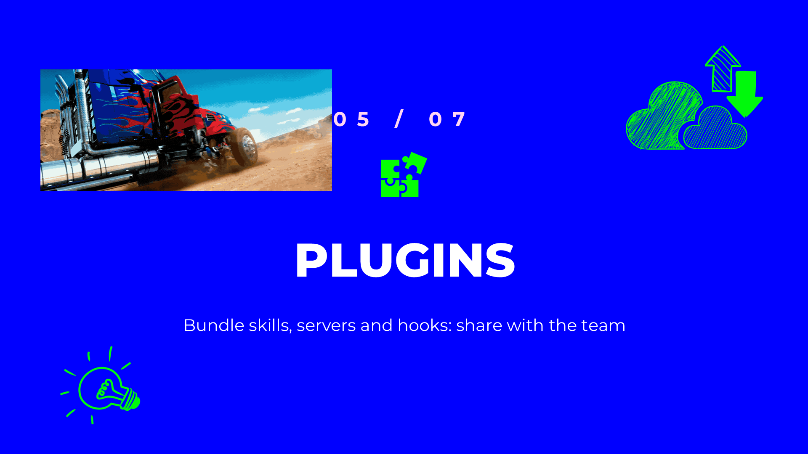
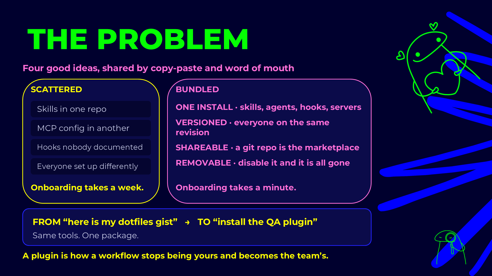
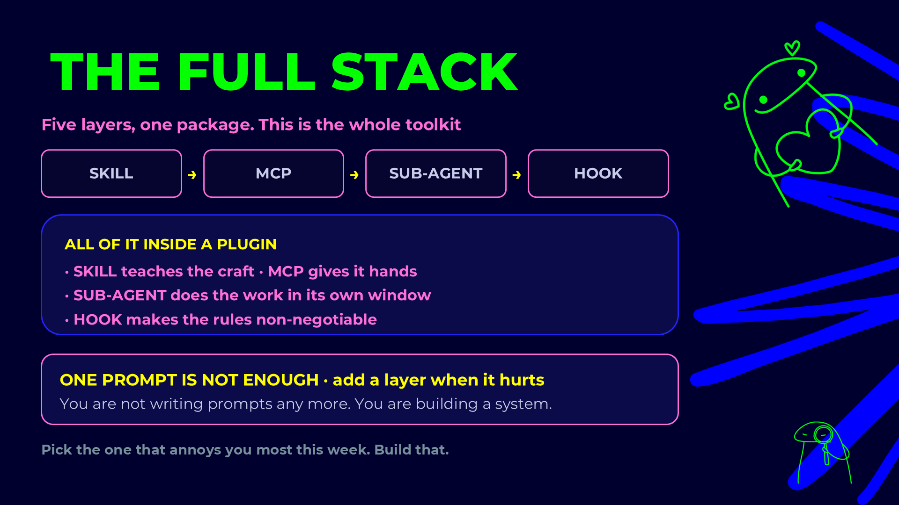
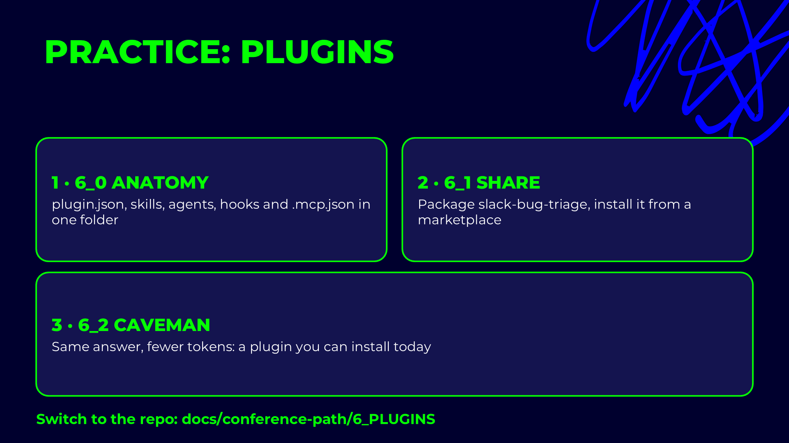
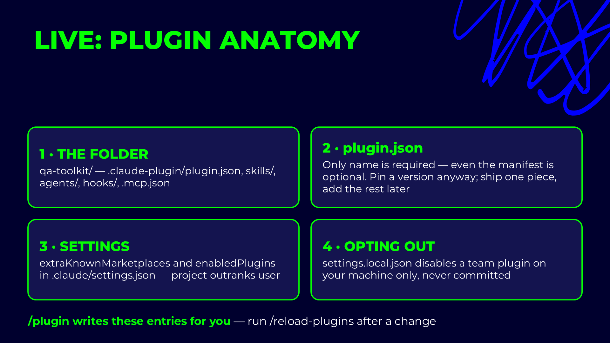

# Claude Code plugins

## Presentation









## Live demo slides



A plugin is a package of skills, sub-agents, commands, hooks and MCP servers that installs in one step.
Everything you build in a project's `.claude/` folder works only in that project. A plugin is how the
same set reaches another repository, or a whole team, and stays updatable from one place. A
**marketplace** is a list of plugins, usually a Git repository, that people add once and install from.

## Architecture

```text
GitHub repo (marketplace)
├── .claude-plugin/
│   └── marketplace.json            list of plugins in this repo
└── plugins/slack-bug-triage/       one plugin
    ├── .claude-plugin/
    │   └── plugin.json             manifest (required)
    ├── skills/slack-bug-triage/
    │   └── SKILL.md
    ├── agents/
    │   ├── triage-slack-collector.md
    │   └── …
    ├── hooks/hooks.json            optional
    ├── .mcp.json                   optional
    ├── scripts/                    anything the skill or agents run
    └── README.md
```

| Part | What it is |
|---|---|
| `.claude-plugin/plugin.json` | The manifest: name, version, description. The only required file. |
| `skills/`, `agents/`, `commands/` | Same format as in `.claude/`. Picked up automatically. |
| `hooks/hooks.json` | Hooks, same format as the `hooks` key in settings. |
| `.mcp.json` | MCP servers the plugin starts. |
| `${CLAUDE_PLUGIN_ROOT}` | The plugin's install folder. Use it in every path a skill, agent or hook runs, because the plugin does not live where it was written. |

Plugin skills and agents are namespaced: `slack-bug-triage:triage-bug-filer`, so they never clash with a
project's own files of the same name.

## `plugin.json` fields

```json
{
  "name": "slack-bug-triage",
  "description": "Triages a Slack bug-reports channel into Jira.",
  "version": "1.0.0",
  "author": { "name": "Kostiantyn Teltov", "url": "https://github.com/dneprokos" },
  "keywords": ["slack", "jira", "bug-triage", "qa"]
}
```

| Field | Required | What it does |
|---|---|---|
| `name` | yes | The plugin id, and the namespace of its skills and agents. |
| `description` | no | Shown in the `/plugin` browser. |
| `version` | no | Bump it on each release so installs know there is an update. |
| `author` | no | Name, email, url. |
| `keywords` | no | Help people find it in a marketplace. |

## `marketplace.json` fields

```json
{
  "name": "suvore-qa-confa",
  "owner": { "name": "Kostiantyn Teltov" },
  "plugins": [
    {
      "name": "slack-bug-triage",
      "source": "./plugins/slack-bug-triage",
      "description": "Turn a Slack bug-reports channel into Jira tickets.",
      "category": "workflow"
    }
  ]
}
```

| Field | What it does |
|---|---|
| `name` | The marketplace id, used in `plugin@marketplace`. |
| `owner` | Who maintains it. |
| `plugins[].name` | The plugin id to install. |
| `plugins[].source` | Where the plugin is: a relative path in this repo, or another Git repository. |
| `plugins[].description`, `category` | Shown in the `/plugin` browser. |

## Commands

```text
claude --plugin-dir ./plugins/slack-bug-triage               # try it without installing
/plugin marketplace add dneprokos/suvore-qa-confa-test-automation
/plugin install slack-bug-triage@suvore-qa-confa
/plugin                                                     # browse, enable, disable, update
```

A plugin runs with your permissions, hooks included. Install only from marketplaces you trust, and read
its hooks before you enable it. The full walkthrough is in
[`6_1_plugin-marketplace`](../6_1_plugin-marketplace/create-and-install-plugin.md).
