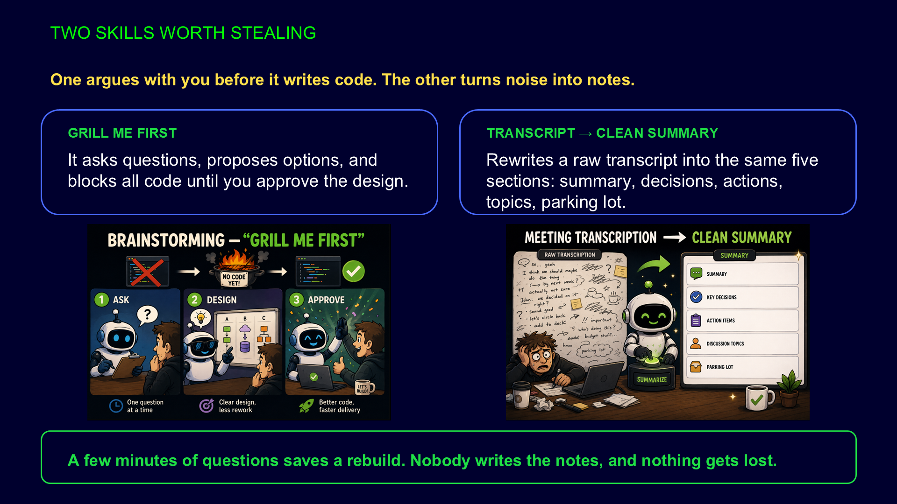

# Meeting notes summarizer — raw transcript to a paste-ready recap

## Slides




Input: the raw transcript of Testing Minutes, episode 55 (Ukrainian, auto-transcribed, no speaker
turns cleaned up). Expected output: the `-summary-ua.md` file next to it — five fixed sections: summary,
decisions, action items, topics, parking lot.

## Run it

```text
/meeting-notes-summarizer summarize "docs/conference-path/8_REAL_USE_CASES/8_2_meeting-notes-summarizer/Testing Minutes-Епізод 55 - Про паттерни в автоматизації-transcript-ua-readable.txt".
Keep it in Ukrainian. Format it for Teams.
```

Variant for a mixed audience:

```text
Same transcript, but write the recap in English. Keep people's names exactly as they appear.
```

## What to point at

- **Same five sections every time.** Run it twice: the wording moves, the structure does not.
- **Action items without an owner or a date** are flagged as unclear, not given an invented owner.
- **Names are preserved as written** in the source, even when the transcript spelled them oddly.
- Compare with the committed `-summary-ua.md` to show what one earlier run produced.
