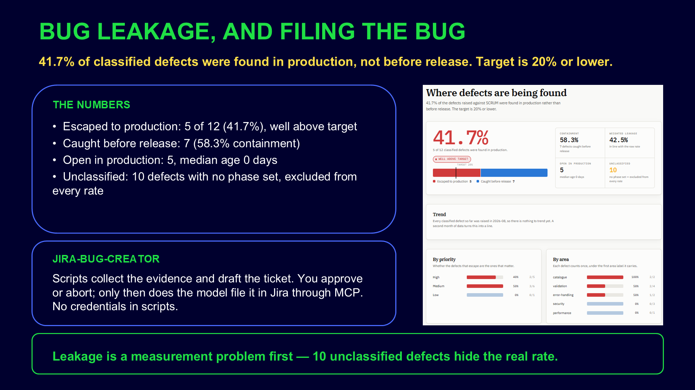

# Bug leakage — defect leakage metrics for the SCRUM project

## Slides



```text
/jira-metrics-bug-leakage Measure bug leakage for my current Jira project (SCRUM).
Show the terminal summary, write the report and publish the dashboard.
```
