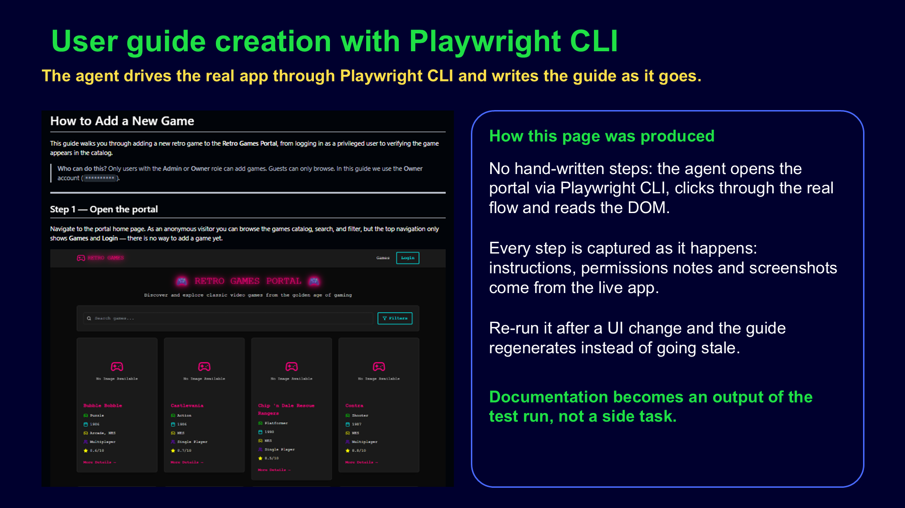

# Web user guide — plain-words scenario to a guide with screenshots

## Slides



```text
/web-user-guide http://localhost:9000/ user go to card details

navigate to http://localhost:9000/
select game card with an image
game card details should be shown
```
