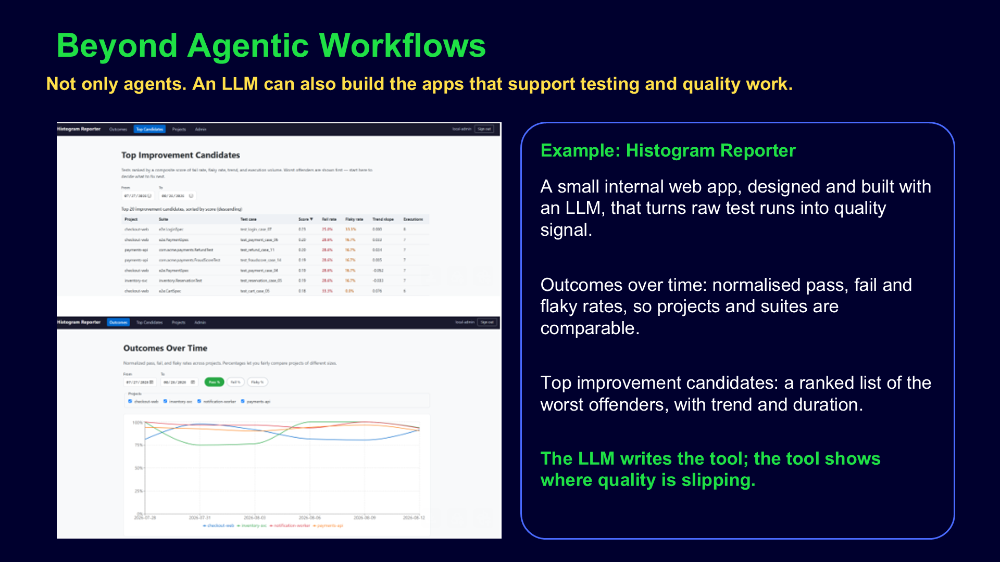

# Beyond agentic workflows

## Presentation

## Key idea

Agentic workflows are only one way to use AI. With AI you can also build whole applications and tools
that help QA every day:

- **Reporting** — dashboards, metrics and summaries generated from Jira, test runs or Slack.
- **Testing** — helper tools, test data generators, utilities and scripts that speed up manual and
  automated testing.

You do not need a multi-agent pipeline to get value — describe the tool you need, and let AI build it.
