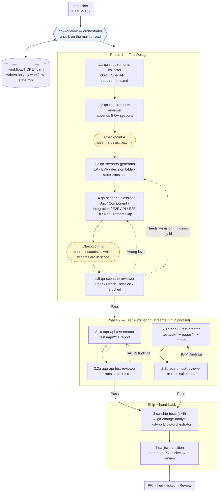

# Presentation Plan — The Agentic QA Workflow

Slide-by-slide plan for the conference talk. The source of truth for each slide's content is named on the
slide, so nothing here has to be remembered — regenerate a slide by re-reading its source.

**Deck length:** 30 slides. **Target:** 40–45 min + 10 min Q&A.
**Per-slide budget:** title/section 20 s · concept 60–90 s · agent slides 45–60 s · demo 8 min.

**Slide conventions**

- Every agent slide uses the same six-line skeleton (goal · in · out · tools · one guard rule · why it
  exists apart). Same shape every time = the audience stops reading layout and starts reading content.
- Code and paths in monospace; never more than 7 lines of code on a slide.
- One idea per slide. The reasoning goes in the speaker notes, not on the slide.

---

## Section 0 — Framing (3 slides)

### Slide 1 — Title

- **The Agentic QA Workflow — one Jira ticket → a reviewed pull request full of Playwright tests**
- Speaker, role, conference, date.
- Notes: state the promise up front — this is a working system in a real repo, not a concept deck.

### Slide 2 — The problem *(added; important)*

- Shipping tests for one ticket is **not one task**: read the ticket → find what it forgot to say →
  derive scenarios → decide the honest test level → implement in two stacks → review both → branch,
  commit, PR → move the ticket back.
- That is 8–9 tasks with **different notions of "good"**, several of them **adversarial on purpose**.
- One prompt asking one model to do all of it produces confident, unreviewable output.
- Source: `docs/conference/agent_build_plan.md` § *The problem*.

### Slide 3 — The thesis

- **The split is the design.** Agents that cannot see each other. A reviewer that shares the writer's
  blind spot reports nothing. A generator that picks its own scope always has enough coverage.
- Three one-liners that carry the whole talk:
  1. No agent names another agent — routing lives in one file.
  2. Reviewers hold no `Edit` — one that can fix things returns Pass, and the signal disappears.
  3. Arithmetic goes in a script, not in a model.
- Notes: tell them these three come back on the last slide.

---

## Section 1 — The application under test (2 slides)

### Slide 4 — The app: Retro Video Games Portal

- What it is: a small full-stack portal — public games catalogue with search and pagination, JWT login,
  an **Owner Panel** that manages admin users.
- Roles: **owner** (admin CRUD) vs **admin**. Every `/api/admin` route is owner-only.
- The API surface actually exercised:
  - `POST /api/auth/login`
  - `GET /api/games`, `GET /api/games?search=&limit=&page=`, `GET /api/games/:id`
  - `GET /api/admin/users`, `POST /api/admin/users`, `DELETE /api/admin/users/:id`, `GET /api/admin/stats`
- SPA at `http://localhost:9000`, Swagger UI at `:5000/api-docs`.
- Source: `services/api/endpoints.ts`, `README.md`.

### Slide 5 — The suite the agents write into

- Playwright + TypeScript, two projects: `api` (no browser) and `ui` (Desktop Chrome), `fullyParallel`.
- The layering the agents must respect — one diagram, no prose:

  ```text
  @playwright/test → fixtures/api-fixture.ts → fixtures/pages-fixture.ts → specs
  ApiFacade → AuthApi / AdminApi → *RequestBuilder → toApiResult() → { response, status, ok, body }
  pages/  locators + actions, never assertions      utils/  every value a spec sends
  ```

- Why this matters for the talk: **the agents did not get a blank page.** They generate into a codebase
  with house rules (`CLAUDE.md`), and most review findings are house-rule findings.
- Notes: this is the answer to "does it produce slop?" — the etalons and the reviewers are the answer.

---

## Section 2 — Architecture, high level (4 slides)

### Slide 6 — The two phases + the mermaid diagram (the money slide)

The repo carries its own version of this picture at
`.claude/skills/qa-workflow/references/workflow-map.md` — same topology, drawn in **step ids only**,
because a file under the skill's `references/` may not name an agent. It goes further than the slide does
(gates, the loop cap, the state write, all five terminal states); raid it for speaker notes and for the
backup slides. The slide below is the deck's own variant: agent names on the nodes, one screen, no cap
arithmetic.

Paste as-is:



- Say out loud while it is up: solid arrow = advance, dashed = a review sending work back, and the
  **only** component that draws any arrow at all is the orchestrator.

### Slide 7 — The roster in one table

| # | Agent | In → Out |
|---|---|---|
| 1 | `qa-requirements-collector` | ticket id → requirements doc, ticket → In Progress |
| 2 | `qa-requirements-reviewer` | requirements doc → five QA sections appended |
| 3 | `qa-scenario-generator` | requirements → test design (ISTQB techniques) |
| 4 | `qa-scenario-classifier` | test design → a level on every scenario |
| 5 | `qa-scenario-reviewer` | test design → verdict + findings by id |
| 6 | `aqa-api-test-creator` | E2E API scenarios → `tests/api/**` + report |
| 7 | `aqa-api-test-reviewer` | code + report → verdict, findings by file:line |
| 8 | `aqa-ui-test-creator` | E2E UI scenarios → `tests/ui/**` + `pages/**` + report |
| 9 | `aqa-ui-test-reviewer` | code + report → verdict, findings by file:line |
| 10 | `git-change-analyst` | working tree → commit message + PR facts (writes nothing) |
| 11 | `qa-jira-transition` | PR URL + target status → ticket commented and moved |

- Plus **8 skills**, **3 scripts**, **1 hook on 3 events**.
- The naming rule, on the slide: `qa-*` = design phase, `aqa-*` = anything that writes or reviews **test
  code**. **Slug prefix and tool grant always agree.**

### Slide 8 — What travels between agents *(added; important)*

- **Artifact paths, not conversation history.** Every agent re-reads from disk. Nothing is handed over in
  a chat log.
- The four artifacts of a run:
  - `requirements/<TICKET-ID>-requirements.md`
  - `test-design/<TICKET-ID>-test-design.md`
  - `.workflow/reports/<TICKET-ID>-{api,ui}-implementation.md`
  - `.workflow/<TICKET-ID>.yaml` — the state file
- The consequence to say out loud: each agent starts **cold**, its context stays small, and its result is
  reproducible from files alone.

### Slide 9 — Shared references — `docs/automation/`

- Two agents that must agree on a rule cannot each hold their own copy. They cannot share a skill either —
  **no agent's `tools:` list includes `Skill`**. So shared knowledge is documents on disk, read by path.
- Three folders, and the folder says **when the text loads**:
  - `etalons/` — a form to copy, read unconditionally (`api-spec-etalon.md`, `ui-spec-etalon.md`)
  - `contracts/` — a process rule for a run (`revision-`, `review-verdict-`, `implementation-report`)
  - `references/` — knowledge on demand at one anchored step (`api-surface-reading`,
    `browser-exploration`, `test-basis-modelling`, `test-design-document-shape`)
- The war story: the two etalons were extracted **after the copies had already diverged** — the review step
  graded against a request form the implementing step was forbidden to write. Neither file was wrong on its
  own terms. *The rule a document is written against and the rule it is reviewed against must be the same
  words.*
- **Not a token optimisation** — a cold subagent pays the same for a `Read` as for an inline block. What
  extraction buys is **agreement**.

---

## Section 3 — The agents, one per slide (11 slides)

Skeleton for every slide in this section:

```text
GOAL       one sentence
IN  →      parameters / files
OUT →      artifacts + receipt line
TOOLS      the grant, verbatim
GUARD      the one rule that makes it safe
WHY APART  why this is not merged into its neighbour
```

### Slide 10 — `qa-requirements-collector`

- **Goal:** turn a ticket into a testing-oriented requirements document, and map the real API surface.
- **In:** `ticket_id`, `endpoint_hints`, `api_surface_mode`. **Out:**
  `requirements/<TICKET-ID>-requirements.md`, ticket moved to `In Progress`.
- **Tools:** Read, Write, Glob, Bash (one command), 6 Atlassian calls.
- **Guard:** its `Bash` grant is exactly `node scripts/api-surface.mjs --match <keys>` — it slices the
  OpenAPI document out of the app's Swagger bootstrap. **Nothing else in the repository fetches or parses
  that document.**
- **`# API Surface` is the star:** the single source of endpoint mechanics for the whole run, and it ships
  a `## Spec Gaps` list, because the spec is incomplete (`GET /api/games` omits `limit`/`page`; no operation
  documents an error message string). Everything under Spec Gaps stays `unknown:` downstream.
- Say it plainly: **a human may supply the surface; nobody may synthesise it.**

### Slide 11 — `qa-requirements-reviewer`

- **Goal:** find what the ticket forgot to say — ambiguity, missing validation / error / permission /
  boundary / integration / data / observability detail, risks, assumptions, open questions.
- **Out:** five QA sections **appended** to the same file.
- **Guard:** it appends, it never fills in. A gap answered by the reviewer is a gap nobody escalates.
- **Why apart:** the installed `requirements-reviewer` **skill** was written for a human in a chat window —
  it asks the user questions and emits a standalone report. A subagent has no user to answer: it stalls, or
  it answers itself. The two rubrics turned out complementary (how a requirement is *written* vs. what
  testing detail is *missing*), so the agent carries both and the skill stays installed for interactive use.
- Talking point: **an installed skill is not automatically reusable.**

### Slide 12 — `qa-scenario-generator`

- **Goal:** derive a complete, traceable scenario set — happy path, negative, boundary, validation, error,
  permission, data, integration, retry/timeout, state transition, non-functional, regression impact.
- **Techniques (ISTQB black-box):** equivalence partitioning · boundary value analysis · decision table ·
  state transition. The mechanics live in `references/test-basis-modelling.md`, **read at the step, with a
  `Must not` against working from memory.**
- **Guard 1 — it does not choose its own scope.** The orchestrator sizes the basis and batches it
  (`batch_threshold` 15, `batch_size` 10) and passes `requirement_ids` down. *A batch is not a review round.*
- **Guard 2 — it may not return until `test-design-lint.mjs` exits `0`.**
- Show one real scenario block: id, technique, coverage items, requirement trace, `Expected:`.

### Slide 13 — `qa-scenario-classifier`

- **Goal:** assign the **lowest technical layer at which the scenario has an assertable, truthful oracle**.
- Levels: Unit · Component · Integration · E2E API · E2E UI · **Requirement Gap** — a pseudo-level for a
  scenario with no assertable oracle at all. Never a test layer, never executable coverage, reported under
  *Blocked / Requirement Gaps*.
- **Three different questions, and this slide is where the audience gets it:**
  - `Assigned Level:` — at which layer is it honestly testable?
  - `Automation Suitability:` — can it be automated **now**? (`Manual only` is legal at every level)
  - `Folds Into:` — which test **executes** it?
- **Folding — the pass that was missing.** Demotion answers "a lower level still catches this"; folding
  answers "only the real stack catches this, but another E2E scenario already walks the same route".
  **Data is not traversal**, and EP and BVA produce N data cases over one behaviour *by construction* — so a
  technique working correctly hands the pass N scenarios that look like N journeys and are one.
  A folded scenario keeps its id, level, trace and coverage items; only its second traversal is gone.
- The real defect to name: SCRUM-132 shipped SCN-018 as its own UI test beside SCN-001 — same actor, same
  entry, same route, a bigger catalogue. **Folding reduces tests, never coverage.**

### Slide 14 — `qa-scenario-reviewer`

- **Goal:** an independent audit — coverage gaps, missing negatives and boundaries, duplicates,
  contradictions, wrong levels, unsound technique application (uncovered partitions, weak BVA, uncovered
  decision rules, untested transitions).
- **Out:** `Review Status: Pass | Needs Revision | Blocked` + `[DESIGN-*]` findings cited by scenario,
  requirement and coverage-item id.
- **Guard:** **no `Edit`, no `Write`.** `Bash` for exactly `node scripts/test-design-lint.mjs` — not the
  suite, not `tsc`, not git — and it is **barred by name from the two `--apply-*` modes**: a reviewer that
  repairs the document's arithmetic before judging it is reviewing its own work.
- It reads the lint output as **pre-computed evidence** instead of recounting.

### Slide 15 — `aqa-api-test-creator`

- **Goal:** implement every `E2E API` scenario as a spec under `tests/api/`, reusing the fixture, facade and
  builder layers; run the full API suite + `tsc --noEmit`; write the implementation report.
- **The house rule it must obey:** in an API spec the `// Act` is **always the builder**, one `with*()` per
  field sent, so the whole request reads at the point it is made. Controllers are for Arrange and Assert.
- **Guard — scope the loop, never the gate:** changed specs while debugging; **full suite once before the
  report, in every mode including a revision.** A page object is shared by every spec that uses it, so only
  the wide run sees a fix in one file break another.
- Show the receipt: `API_SDET_RESULT: OK`, `EXECUTION:`, `Review Findings Addressed`.

### Slide 16 — `aqa-api-test-reviewer`

- **Goal:** every `E2E API` scenario implemented; the code matches `api-spec-etalon.md`; status and contract
  assertions; auth coverage; isolation; cleanup; framework reuse; no hard-coded values or secrets.
- **Guard:** it **re-runs the suite and the type check itself.** That looks like duplicated work and is not —
  **it is the trust boundary.** A reviewer that trusted the counts it was handed is not an independent check.
- Rows 4 and 23 of its checklist: **a value asserted must appear in the design's `Expected:`** — anything
  else is an invented value or a guessed mechanic.

### Slide 17 — `aqa-ui-test-creator`

- **Goal:** the same, for `E2E UI` — specs under `tests/ui/`, page objects under `pages/`.
- **Two extra powers, both interesting:**
  - **browser exploration** through the `playwright-cli` skill — named session, always closed, snapshot
    refs never committed, and **never derive a requirement from what the UI currently does**.
  - the only write-boundary carve-out in the repo: **additive-only into `services/api/`**, because a UI test
    cannot clean up a resource the facade has no method for. Add a controller/builder, a key in
    `endpoints.ts`, one `readonly` member on `ApiFacade`. Modify nothing. Every addition on
    `SHARED_ADDITIONS:`. Additive-only is what makes it safe with both streams in flight.
- **The locator tier ladder** — put it on the slide:
  1. `getByRole` / `getByLabel` / `getByPlaceholder` / `getByTestId`
  2. `#id` · 3. non-testid `[data-*]` · 4. structural CSS — each costs **three receipts**
  **Outside the ladder entirely:** XPath, generated class names, marketing copy, `nth()` on a data row.
  An element with no stable hook is **a gap to report**, not a problem to solve with a brittle selector.
- **A locator says where an observable is; it never says how the page gets there.** Hence the second map,
  *Observed Mechanics*: does this action fire a request and which one · what proves a re-render finished ·
  what shape the empty/error state takes · what triggers the action · does it raise a native dialog.

### Slide 18 — `aqa-ui-test-reviewer`

- **Goal:** locator stability, fixed waits and flaky patterns, page-object usage, assertion quality,
  isolation and cleanup, secrets — plus scenario coverage against the design.
- **Guard:** it holds **no browser.** Its whole evidence about the running system is the two maps the creator
  carried into the report — `Explored Locators` and `Observed Mechanics`.
- It rules **both directions**: a `waitForResponse` on a route nobody watched fire, and a recorded request
  the code never waits on, are the same defect from opposite ends — and the second is the one a diff misses,
  because nothing is there to look wrong.

### Slide 19 — `git-change-analyst`

- **Goal:** read the working tree; return a proposed Conventional Commits message plus PR facts — branch,
  base, staged and unstaged lists, subjects ahead of base, changed-file groups, a secret-file warning.
- **Guard:** no `Write`, no `Edit`. It stages nothing, commits nothing, pushes nothing, opens nothing.
- **Why apart — the git row is split by *mutation*, not by topic:** committing needs two human confirmations
  and opening a PR a third, and **a subagent can ask for none of them** — so the four `git-*` skills stay
  skills on the main thread. But *reading* the tree is the largest context cost in the ship phase and needs
  no human at all. Same prefix, opposite powers: **the tool grant is what tells them apart.**

### Slide 20 — `qa-jira-transition`

- **Goal:** close the loop — comment the PR URL on the ticket, move it to `In Review`.
- **Guard:** **no filesystem tools at all** — five Atlassian calls and nothing else. It cannot read a report,
  so it cannot summarise one: every claim in its comment is a value from its prompt or a fact Jira just
  returned.
- **General-purpose, and the caller names the status.** `target_status` is required, never defaulted.
  The ladder: `To Do` < `In Progress` < `In Review` < `Done` — forward one hop only, never backwards, never
  out of a `Done` ticket, never through an intermediate. It reports the status it **re-read**, not the one it
  asked for.
- **Why it exists:** ending at the pull request leaves the ticket `In Progress` with no link to the work —
  the one state a board cannot recover from on its own. The return leg mirrors the intake leg.

---

## Section 4 — The machinery around the agents (4 slides)

### Slide 21 — Scripts: arithmetic does not belong in a model *(added; important)*

- **`test-design-lint.mjs`** — 20 `TD-E<nn>` structural and arithmetic checks + 5 mutually exclusive modes:
  `--emit-summary` / `--emit-levels` (print), `--apply-summary` / `--apply-levels` (write, idempotent),
  `--emit-manifest` (the whole model as JSON).
  - The writing step **applies** the counts. The reviewing step **reads** them. The reviewer is barred from
    the apply modes.
  - `classified: false` → **an unclassified design reports zero at every level**, which is a true statement
    about the document and the exact opposite of what a gate would conclude from it. That field is what makes
    it safe to gate Checkpoint B on.
- **`workflow-state.mjs`** — validates *and writes* the state file. `WS-E01` exists because
  `.workflow/SCRUM-132.yaml` carried `last_findings` **twice** — an 1800-character routing block, then
  `null`. YAML keeps the last value, so an entire review round ran on findings **nobody could read**, with a
  document that parsed cleanly the whole time.
  - **Every write re-emits the whole document from the parsed model** — a duplicate key is now *unreachable*,
    not merely reported. Validation is containment, not a cure.
  - `check-artifacts` asks the other question: not what the file says, but **what is still on disk**
    (exit `4`). Three resumes routed correctly on a false premise and failed at the point of use.
- **`api-surface.mjs`** — the only thing in the repo that touches the OpenAPI document.

### Slide 22 — Cost: measured from outside the conversation

*(Live figures for this slide: `docs/conference/run-report-SCRUM-132.md`, Table 2 — including the
`async_uncosted` rows and the three `no_result` diagnostics from the period the hook was silently broken.)*

- **No agent can report its own tokens or duration.** The harness computes them after the subagent stops;
  the tool result the caller sees carries only text.
- One hook script on **three** events — `PreToolUse`, `PostToolUse`, `PostToolUseFailure`. Three, not one,
  **because an interrupt is an event and not an absence**: a PostToolUse hook cannot fire for a run that never
  completed, so on its own it cannot tell "no agent ran" from "an agent ran and the session was killed
  underneath it".
- **`usage` describes one message, not the run** — so the block is named `end_context`,
  `scope: "final_turn"`. A record showing **115 tool calls against 1,214 output tokens** is the last turn of
  an expensive run, not a cheap one. **`tool_uses` is the honest measure of work.**
- The report **prices what it can and refuses to price the rest**: dated list rates, exact arithmetic — and
  the figure is the price of the **final message**, never the run's bill. **An unknown model is unpriced, not
  guessed.** A plausible number is the one failure mode a cost table cannot survive.
- The war story worth telling: the hook shipped with four silent early returns and an empty `catch {}`, and
  wrote **no record at all for its entire life**. The script was correct; its wiring was not. The subagent
  tool ships under two names — `Task` and `Agent` — and both the settings matcher and the hook's own guard
  were written against `"Task"` alone. **Every failure this hook has had was the script being right and its
  registration being wrong**, so the test now reads the real `settings.json` and asserts it matches.

### Slide 23 — Modes: every agent runs more than once

- `first_run` · `EXISTS` (output present, nothing new asked → **change nothing**) · `revision` (change only
  what the findings name; everything else **byte-identical**) · `regenerate` (explicit token).
- Reviewers write nothing, so they take `previous_findings` → `re_review`: the style pass narrows to prior
  findings and changed files, while **the suite, the type check and the coverage pass stay full every
  iteration**.
- **Findings carry stable ids** — `[API-C1]`, `[UI-M2]`, `[DESIGN-C1]`, `[REQ-M1]` — and each is answered
  `fixed`, `disputed` or `not applicable`. **Never silently.**
- **A revision is scoped by what the findings name, not by a field allowlist.** SCRUM-132's design argued with
  itself over exactly this: four findings needed a `Coverage Item:` edit, and each was answered by a
  coverage-gap entry that agreed with the defect and **left it standing**.
- **`reset` is the only command that moves a run backwards** — archives by rename, never deletes, `--reason`
  mandatory, and **delegates nothing**: one typed flag must not become nine unattended delegations.

### Slide 24 — The gates *(added; important)*

- **Checkpoint A** — size the test basis, batch it.
- **Checkpoint B** — count from the **manifest**, not from prose; decide which streams are in scope.
  **Either stream can be `not_applicable`** — zero `E2E UI` scenarios settles the UI stream, a half the schema
  always permitted and no rule ever set, so a design assigning no UI work still launched the two most
  expensive steps in the run. `not_applicable` is a **finished state, never a failure** — and it needs a
  stated reason, or it is indistinguishable from a stream somebody forgot.
- **Auto mode's two gates are settings rather than rules, and both default to stopping:**
  `on_missing_api_surface`, `on_blocked_alternative_flow`. Relaxing one **approves nothing** — the blocked
  scenarios still ship `Manual only`, no `Expected:` gains a value. The only thing it decides is whether a
  human is fetched now or reads the open question later. **A relaxed gate is printed twice** — at the banner
  and at the gate — because why a run did *not* stop is the one thing nobody can reconstruct afterwards.
- **The one decision no agent may make:** an unapproved assumption.

---

## Section 5 — The orchestrator (3 slides — the finale)

### Slide 25 — `qa-workflow` — why the conductor is a skill, not an agent

- **A subagent cannot spawn subagents and cannot see skills.** Anything that routes has to run on the main
  thread — so **the one component that knows the whole workflow is the one component that is not part of it.**
- It is **the only file in the repository where two agent names appear next to each other.** That is the
  entire reason the no-sibling-names rule holds everywhere else.
- Invocation: `/qa-workflow SCRUM-139 [--auto] [--dry-run] [--reset]`.
- **Must not:** perform requirements analysis, scenario generation, classification, review or test
  implementation itself. It does **none** of the work.

### Slide 26 — What the orchestrator actually owns

- The **step registry** — one row per step: agent, parameters passed, receipt line to parse, artifacts
  produced. Delegate one step at a time, **artifact paths not conversation history**.
- The **state file** `.workflow/<TICKET-ID>.yaml`, and the three-move delegation:
  1. `append <TICKET> in_flight --json …` — **before the launch**
  2. launch
  3. on the receipt `clear-in-flight`, then parse, then persist

  **A step launched without its `in_flight` entry is invisible to a resume** — the session dies, and the next
  one cannot tell an interrupted delegation from one that never started.
- **Routing by section, not by severity:**

  | Finding | Routed to |
  |---|---|
  | `[DESIGN-*]` missing scenarios / duplications / technique / risks | scenario generator |
  | `[DESIGN-*]` incorrect classifications | scenario classifier |
  | `[REQ-*]`, or a design finding rooted in a missing requirement | **escalate — a person answers it** |
  | `[API-*]` / `[UI-*]` | that stream's creator |

  Both design buckets in one review = classifier, then generator, then the reviewer once. **That is one
  iteration, not two — the counter tracks review rounds, not delegations.**
- **The run-parameters banner** — every row of `## Inputs`, its resolved value, and its **source**:
  `request` > `state` > `default`, which is also the precedence order. Most values are defaults nobody chose,
  and on a resume the ones that matter came out of a state file written by a command line nobody still has.

### Slide 27 — Manual mode vs auto mode

| | Manual (default) | Auto (`--auto`) |
|---|---|---|
| Between steps | `AskUserQuestion` after **every** step | routes on the normalized verdict |
| Loop control | none — every loop is already a human decision | `max_review_iterations` (default 2), then **escalate** |
| Git confirmations | kept | **kept** |
| Gates | asks | two settings, both default to stopping |
| Prints cost per step | yes | yes — an unattended run that prints nothing is unauditable |

- **Every `AskUserQuestion` carries a Decline option, in both modes, without exception**, listed last.
  A question with no way out is not a question. A decline is a **legitimate end state**, and it reports
  *more* carefully than a completed run, not less.
- **Never loop past the cap, and never lower the bar to clear it.**

---

## Section 6 — Close (3 slides)

### Slide 28 — Live demo / recorded run *(added; important — have a recording behind it)*

- `/qa-workflow SCRUM-XXX --auto` on a ticket nobody has seen.
- What to point at while it runs: the banner → a receipt → an `AGENT_RUN_METRICS` line → a `Needs Revision`
  routing back → the PR → the ticket in `In Review`.
- **Have a recording.** The app must already be up at `BASE_URL`; there is no `webServer` block.

### Slide 29 — Where the speed came from

| Was | Now |
|---|---|
| Full suite on every fix cycle — up to 4 per pass | Changed specs while debugging, full suite **once** before the report |
| A revision re-ran everything to fix one line | The same split, on a revision too |
| One missing locator bought a whole exploration session | `Grep pages/` first, explore only what is missing |
| A classifier hand-counted a table, 3 totals and 2 id lists | A script emits them; the agent keeps the judgement |
| The same gap restated under eight requirements | One finding, eight ids on it |
| Reviewers re-ran the suite — looked like waste | **Unchanged. It is the trust boundary, not duplication** |

- One line to land it: **not from running less — from running the cheap thing narrow and the load-bearing
  thing wide.**

### Slide 29b — One real run, measured *(added; real data)*

Everything on this slide comes from `docs/conference/run-report-SCRUM-132.md`, which is copied out of the
metrics log and the archived state file — no illustrative numbers.

- **SCRUM-132** — 4 FR + 1 AC in; **19 delegations, 1 h 43 m of agent time, 339 tool calls** out.
- 17 scenarios → **20** after review. Levels: Component 7 · Integration 1 · E2E API 2 · E2E UI 4 ·
  **Requirement Gap 6**. Executable coverage 14 of 20.
- **26 findings across the run** — 15 design, 5 API, 6 UI. **0 disputed by a creator.**
- Shipped: 11 paths, **1,076 insertions, 0 deletions**.
- **The inversion, if you show one cost pair:** the UI creator = 115 tool calls, 27 min, final message
  **$0.07**. The UI reviewer beside it = 27 tool calls, 5½ min, final message **$0.25** — 3.4× the price off
  a quarter of the calls, because a reviewer's last turn *is* its deliverable. Neither is the run's bill.
- **The four honest failures** — the design review **hit its cap and stopped**; a human overrode 7 findings
  and the `Needs Revision` verdict stands unrewritten; one scenario was reported **not automatable** rather
  than faked; an interrupted creator produced no token figures and **none were invented**.

Notes: show the failures. A report with none in it reads as marketing.

### Slide 30 — The shape, in numbers + the three rules again

| | |
|---|---|
| Subagents | 11 |
| Skills | 8 |
| Scripts | 3 |
| Hooks | 1 script on 3 events (+1 reporting script) |
| Agents that can write to Jira | 2 — one per end of the run |
| Agents that can write test code | 2 |
| **Reviewers that can edit anything** | **0** |
| Agents that can report their own cost | 0 — the harness measures it from outside |
| Full suite runs per implementing pass | 1 |
| Review iterations before escalation | 2 |
| Pull requests per ticket | 1 |

Close on the three from slide 3:

1. **No agent names another agent.**
2. **Reviewers hold no `Edit`.**
3. **Arithmetic goes in a script.**

Repo QR code + `docs/conference/agent_build_plan.md`.

---

## Cut list, if you are over time

Drop in this order — each is self-contained: **21 → 22 → 8 → 24 → 19**.
Never cut 6 (the diagram), 13 (three different questions), 16/18 (the trust boundary), 25 (skill not agent).

## Backup slides — do not present; hold for Q&A

- **B1 — "Does it produce slop?"** → the etalons, the two reviewers, and the red-test rule: *a known
  application defect is asserted against the specification, with a comment naming it. Weakening the assertion
  to go green is Critical. The failure is the report.*
- **B2 — "A citation is not an assertion."** A scenario carrying an `unknown:` marker together with
  `Automation Suitability: Manual only` traces a requirement and asserts nothing → counted **traced-only**,
  and it needs a coverage-gap entry exactly as an uncovered item would. This is what stops a design reporting
  100% technique coverage on the strength of scenarios that claim nothing. SCRUM-132 did exactly that.
- **B3 — What is uncapturable, and says so instead of guessing:** an interrupted agent's tokens; a kill in the
  window before the pre-hook writes; the cost of a background run; the cumulative token spend of any run at
  all. **A background launch is not a completion** — it reaches the table as `async_uncosted`, distinct from
  `interrupted`, because such a run may have finished perfectly.
- **B4 — "Why not one big prompt?"** Adversarial roles, tool grants as the enforcement mechanism, cold context
  per step, and a resume that survives a dead session.
