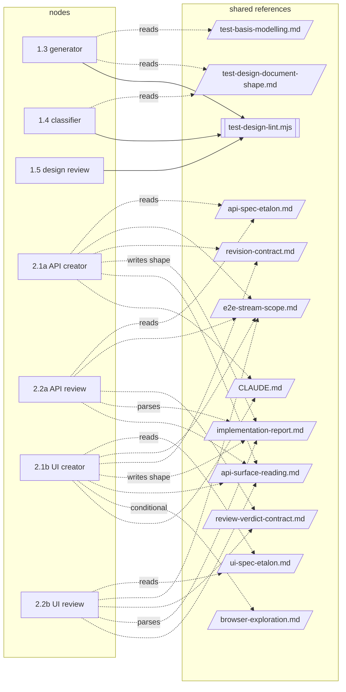

# Agentic Workflow Architecture Review — `qa-workflow`

| | |
|---|---|
| **Entry point** | `.claude/skills/qa-workflow/SKILL.md` |
| **Depth** | `standard` (plus real run evidence from `.workflow/`) |
| **Focus areas** | orchestration, test design, context efficiency, automation — the ask: *no duplicated steps, faster, same quality* |
| **Production context** | conference showcase that must stay close to a real team workflow; single repo; one ticket per run; human-supervised or `--auto` |
| **Date** | 2026-09-09 |
| **Graph** | 11 agents, 3 skills in the ship chain (+4 git skills), 4 scripts, 3 hook events; 12 shared references |
| **Files read** | 34 — listed in the appendix |

## 1. Overall assessment

| Score | Maturity | Confidence |
|---|---|---|
| `6/10` | `Production Candidate` | `Medium` — two costed runs (SCRUM-132, SCRUM-115) and no run yet reached a merged PR; Phase 2 agent bodies were extracted by two read-only subagents and spot-checked, not read line by line |

The workflow is structurally sound: routing lives in one place, reviewers cannot write, the state file and the design document are validated by scripts, and every step is resumable. What stands between it and production is **volume, not correctness**. On the one fully measured ticket (SCRUM-132: 4 FR + 1 AC) Phase 1 took 9 delegations and ~60 minutes of agent time to yield 6 E2E scenarios, then hit the review cap and needed a human override; Phase 2 took another ~44 minutes for 5 tests. The same rules are written in up to seven places, both reviewers hand-grep a dozen checks a script could run, and the ship phase composes a commit message and PR body that the git skills discard. The fixes below remove delegations and re-reads without touching a single quality gate.

### The numbers this review is written against

From `.workflow/metrics/SCRUM-132.jsonl` (via `metrics-report.mjs`) and the `history:` of `.workflow/SCRUM-132.yaml.bak-2026-08-20-reset`:

| Step | Runs | Agent time | Outcome |
|---|---|---|---|
| 1.1 collect | 1 | 85s | 5 requirements, 6 operations mapped |
| 1.2 review reqs | 1 | 267s | 20 notes, 6 gaps, 4 open questions, one `[REQ-C1]` blocking — run continued |
| 1.3 generate | 3 | 710s + 842s + 234s | 17 → 20 scenarios; 6 `Requirement Gap`, 9 unknowns, 6 blocked |
| 1.4 classify | 2 | 366s + 432s | 15 of 17 suggested levels overridden; 6 E2E kept |
| 1.5 design review | 2 | 301s + 336s | Needs Revision twice; cap reached; user ruled on 7 findings by hand |
| **Phase 1 total** | **9** | **~59 min** | 2 E2E API + 4 E2E UI scenarios |
| 2.1a / 2.2a API | 2 + 2 | 641s + 426s | 1 scenario implemented (1 skipped), 2 review rounds |
| 2.1b / 2.2b UI | 3 + 2 | ~1,038s + 540s | 4 scenarios, one run interrupted, 2 review rounds |
| **Phase 2 total** | **9** | **~44 min** | 5 tests |

SCRUM-115 (4 scenarios) repeats the shape: nine Phase 1 delegations, one wasted 1.3 run because approvals were keyed on ids that do not exist yet, one classifier abort on a lint false positive, two review rounds, then a UI stream blocked on missing browser binaries.

## 2. Strengths

- **Routing in one file, enforced by tool grants** — `SKILL.md:29-32`, `docs/automation/README.md:667-669`. Verified: no agent body names a sibling; reviewers hold no `Write`/`Edit` (`qa-scenario-reviewer.md:4`, `aqa-*-reviewer.md:4`).
- **Arithmetic is deterministic** — `scripts/test-design-lint.mjs` (21 checks, five modes) and `scripts/workflow-state.mjs` (validate/write/check-artifacts/check-streams/reset) with fixtures under `scripts/__tests__/`. Checkpoint B reads `--emit-manifest` (`SKILL.md:523-547`), not prose.
- **Honest cost accounting** — the hook records interrupts and background launches as distinct rows and refuses to price what it cannot see (`references/run-cost.md`; report footnotes in `metrics-report.mjs` output).
- **Stream independence and `not_applicable`** — a UI-only ticket no longer launches the API stream (`SKILL.md:549-572`), and `check-streams` catches a stream settled against the design (`SKILL.md:608-627`).
- **Every write is idempotent by value and resumable** — `in_flight` before launch, `clear-in-flight` on receipt, `EXISTS` on re-invocation (`SKILL.md:320-360`).

## 3. Weaknesses

| Id | Component | Finding | Evidence | Action |
|---|---|---|---|---|
| W1 | `qa-scenario-generator` + `qa-scenario-classifier` | Level is judged three times (suggest → assign → audit); the classifier overrode 15/17 suggestions and costs 366–482s per round; the split forces the "classifier first, then generator, then reviewer" sequencing that SCRUM-115's user had to override because findings interdepend | `qa-scenario-generator.md:315`; `qa-scenario-classifier.md:85-196`; `SKILL.md:469-471`; SCRUM-132 history lines 170,174; SCRUM-115 history line 122 | **Merge** |
| W2 | approvals (`approved_values`) | Approvals are keyed on `SCN-` ids, which exist only after 1.3 — so every approval costs a second 1.3 run, and a `[REQ-C*]` found at 1.2 rides through 1.3/1.4/1.5 before the design gate escalates it | `qa-scenario-generator.md:26,32`; `references/phase-1-design.md:57-71`; SCRUM-115 history line 119; SCRUM-132 `open_questions[0]` | **Redesign** |
| W3 | `qa-scenario-reviewer` loop | Majors inflate (heading wording, `Technique:` label, overlapping partition cells) and new Majors appear on round 2 on blocks nobody changed; cap reached on a 20-scenario doc and a 5-scenario doc alike | `qa-scenario-reviewer.md:159` (Major list), SCRUM-132 `last_findings` M5–M8, m4–m6; SCRUM-115 history lines 122,126 | **Redesign** (severity + re-review scope) |
| W4 | `aqa-*-reviewer` checklists | ~15 of ~25 rows per stream are grep-shaped (no `waitForTimeout`, fixture import, no `expect` in `pages/`, title regex, AAA once, URL/credential literals, `SCN-` comment, boundary of changed files) and are run by hand by an opus agent, after the creator hand-ran the same greps | `aqa-api-test-reviewer.md:141-158,161`; `aqa-ui-test-reviewer.md:162-205`; creators' self-checks `aqa-api-test-creator.md:294-302`, `aqa-ui-test-creator.md:413-425` | **Split** (mechanical rows → script) |
| W5 | agent bodies vs `docs/automation/` | Etalon text is copied verbatim into the API creator (`aqa-api-test-creator.md:163-193` = `api-spec-etalon.md:37-76`) and the UI creator (`aqa-ui-test-creator.md:286-291` = `ui-spec-etalon.md:232-237`); the tier ladder lives in five places; "an asserted value must be in `Expected:`" in seven; "mechanics ≠ values" in seven — the drift the folder was created to stop | `README.md:592-596` states the rationale; copies listed in §5.1 | **Remove** inline copies |
| W6 | etalons | Read in full by both halves of a stream on every mode, including a one-line revision; the API reviewer reads it twice; the UI etalon restates `e2e-stream-scope.md §3` across 65 lines and the API etalon carries ~230 lines only a GET-collection or non-admin seeding scenario needs | `aqa-api-test-creator.md:144-148`; `aqa-api-test-reviewer.md:48,103`; `aqa-ui-test-creator.md:130-134`; `ui-spec-etalon.md:270-335`; `api-spec-etalon.md:104-135,148-291` | **Split** (core + conditional appendices) |
| W7 | `qa-ship-tests` → git skills | Composes a commit message, staging list, PR title and PR body (`qa-ship-tests/SKILL.md:66-148`) that the chain discards: commit-creator drafts via `git-change-analyst`, `create-commit.ps1` stages only with `-StageAll`, `create-pr.ps1` builds the body from commit subjects; the ticket-prefix regex (`create-pr.ps1:401`) never matches `test/SCRUM-139-…`, so the duplicate-PR check cannot fire; `git-change-analyst` may run twice and its PR-facts mode has no caller | `git-workflow-orchestrator/SKILL.md:47-48`; `git-commit-creator/SKILL.md:53-68`; `qa-ship-tests/SKILL.md:86-91` | **Redesign** |
| W8 | UI reviewer inputs | Relies on receipt lines (`API_SURFACE`, `MECHANICS_OBSERVED`, `LOCATOR_GAPS`, `CLEANUP_GAPS`, `SHARED_ADDITIONS`) it never receives — its inputs are a report path and the design; the orchestrator persists six other fields; the API creator's receipt lacks the `CLEANUP_GAPS` line `implementation-report.md:214` requires | `aqa-ui-test-reviewer.md:28-37,54,107,110,169,189`; `SKILL.md:660-662`; `aqa-api-test-creator.md:320-341` | **Redesign** (move to report front matter) |
| W9 | `qa-requirements-reviewer` output | 20 notes + 6 gaps + 4 questions for 5 requirements, and the generator must land every one somewhere (`qa-scenario-generator.md:91`) — the direct source of 9 unknowns, 6 blocked scenarios and 6 `Requirement Gap` blocks in a 20-scenario design | SCRUM-132 history line 168; `test_design.unapproved_unknowns` (10 entries) | **Redesign** (scope to test-blocking gaps; gate before 1.3) |
| W10 | test design document | A scenario with nothing to assert still gets a 12-field block, coverage-item citations (counted traced-only), matrix rows, a `Requirement Gap` level, and 20 review criteria; 8 Component/Integration scenarios become `follow_up_tickets` that nothing creates | `qa-scenario-generator.md:338`; `qa-scenario-classifier.md:100-102`; `SKILL.md:694-696` | **Redesign** (gap entries, not blocks) |
| W11 | orchestrator step "count the test basis yourself" | Re-reads `requirements/` on the main thread to count `### FR-`/`### AC-` headings that 1.1's receipt already returned as `FR_IDS`/`AC_IDS` | `references/phase-1-design.md:10-12`; `qa-requirements-collector.md:285-288` | **Remove** (read the receipt) |
| W12 | receipts / report fields | No consumer found for: creator `TEST_COMMAND`, `NEW_PAGE_OBJECTS`, `EXPLORED_APP`, `KNOWN_LIMITATIONS`; reviewer `Files Reviewed`, `Scenarios Claimed/Verified`, `Suggested Improvements`, `Final Recommendation` (a soft routing line); reviewer `focus`; `git-change-analyst` `STAGED_FINGERPRINT`, `CHANGE_STATS`, PR-facts block; ship `COMMIT` | `SKILL.md:660-662`; `review-verdict-contract.md:162-163`; `git-change-analyst.md:199-225` | **Remove** |
| W13 | revision mode contracts | `regenerate` exists in `CLAUDE.md` and both creators' `MODE:` lines enumerate only `first_run \| revision`; neither creator states whether Steps 2–7 run on a revision (the etalon read is not mode-gated) | `revision-contract.md:19-24`; `aqa-api-test-creator.md:45,322`; `aqa-ui-test-creator.md:43` | **Keep**, fix the table |
| W14 | `references/browser-exploration.md` | Cites `config.ts:28`, `login-page.ts:11-14`, `home-page.ts:8-9` by line number and says requirements come from `requirements/…` only — contradicting the design-is-the-only-spec rule; also points a `docs/automation/` file at a skill (`playwright-cli/SKILL.md`) that subagents cannot invoke | `browser-exploration.md:8,14,77,82-83,218-220`; `revision-contract.md:117-119` | **Keep**, fix |
| W15 | concept doc drift | `agent_build_plan.md` says 3 scripts and twenty `TD-E` checks; the repo has 4 scripts and 21; `implementation-report.md:24-27` claims `.workflow/` has never existed | `agent_build_plan.md:53-55,198`; `CLAUDE.md` | **Keep**, fix |

### High-severity findings

**[W1] generator + classifier — Merge**
*Failure:* Every design round is three delegations before the reviewer sees it, and a review with findings in both buckets is three more. SCRUM-132: 1.3+1.4 cost 1,076s on round 1 and 1,274s on round 2 for the same 20 blocks; the classifier re-read the whole document both times. SCRUM-115's user had to override the classifier-first routing because `DESIGN-M2` (a generator finding) was the root cause of `DESIGN-M1` (a classifier finding).
*Fix:* One design agent, two internal passes in one context: derive (today's Steps 4–7), then classify with the minimum-set pass (today's classifier Steps 3–5) over the blocks it just wrote. Drop `Suggested Level:` (it is overridden 88% of the time and only exists because the two steps are separate). The reviewer stays the independent gate on levels — criteria 9/10/10b already audit them. Keep `--apply-summary` and `--apply-levels` as two script calls inside the one run. Routing table collapses to one target for all four `[DESIGN-*]` buckets.

**[W2] approvals keyed on scenario ids — Redesign**
*Failure:* Manual mode learns the unknowns at 1.2 (`# Missing Information`, `[REQ-M*]`), but can only approve them after 1.3 has written `SCN-` ids, so the approval is a second 1.3 run. SCRUM-115 lost a full 1.3 run to this (`approved_values` naming `AC-1/FR-05.13` were rejected). Auto mode carries a `[REQ-C1]` through three more delegations before escalating.
*Fix:* Accept `approved_values` keyed by `[REQ-*]` id or by `requirement id + missing value name` and honour them on `first_run` (the generator already knows which value it would mark `unknown:`). Add a manual-mode question after 1.2 listing `[REQ-C*]`/`[REQ-M*]` gaps with *approve / leave unknown / escalate*; in auto mode a `[REQ-C*]` on an in-scope AC stops **before** 1.3, not at the design gate.

**[W3] design review convergence — Redesign**
*Failure:* Round 2 raised 4 new Majors on SCRUM-132 (M5 on an unchanged block, M6/M7 on side effects of round-1 fixes, M8 a level wording issue) and the run hit `max_review_iterations` with a human ruling on each by hand. Same on SCRUM-115 (M6, M7 new on round 2). A cap is a stop, not a convergence rule.
*Fix:* (1) Redefine Major in `qa-scenario-reviewer.md:159` as *changes what a test asserts, or whether an in-scope requirement / feasible coverage item is covered*; everything else is Minor and never loops. (2) In `re_review`, a new Major is allowed only on a block that changed or that a previous finding named; a defect on an untouched block is reported as Minor with a note. (3) Default `max_review_iterations` to 1 for the design stream: after one revision, remaining Majors go into the PR body under *Design findings not resolved* and the run proceeds in auto mode — the tests still assert only what the design states, so nothing weakens.

**[W4] mechanical review rows — Split**
*Failure:* Both code reviewers (opus) re-run the suite and `tsc` (correct — that is the trust boundary) and then hand-grep the same patterns the creator hand-grepped: `aqa-ui-test-reviewer.md:193-205` is a table of eleven grep patterns. Measured: API review 238s/22 tool uses, UI review 337s/27 tool uses on first review. A missed grep is a false Pass; a slow grep is cost.
*Fix:* `scripts/spec-lint.mjs <stream> [--changed <paths>]` with `SL-E<nn>` codes: `waitForTimeout|networkidle|setTimeout`; `@playwright/test` import under `tests/`; `expect` under `pages/`; `http://` and `process.env` literals; title regex per stream; exactly one `// Arrange`/`// Act`/`// Assert` per `test(`; `// SCN-` comment per test; `.with[A-Z]` under `tests/ui/`; `uniqueApiEmail` under `tests/ui/` and vice versa; `LOCATOR-FALLBACK` ⇔ `LOCATOR_GAPS` row; changed paths against the stream's write boundary; `xpath=|\.css-|nth(` outside structural use. Creator runs it in self-check, reviewer runs it and reads output as evidence — same shape as `test-design-lint.mjs`, same `Must not treat a clean run as evidence about the code` clause. The reviewer keeps rows that need judgement (assertion carries the value; wait matches an observed mechanic; scenario ↔ test truthfulness).

**[W7] ship phase composes what the chain discards — Redesign**
*Failure:* `qa-ship-tests` spends its context composing a commit message and PR body, then delegates to `git-workflow-orchestrator` section A, which forbids the script path that would accept them (`git-workflow-orchestrator/SKILL.md:48`) and lets `git-commit-creator` draft its own message through `git-change-analyst`. `create-pr.ps1` builds the body from commit subjects. Net: the scenario list, defect list and *Streams Not Run* section never reach the PR; the branch prefix `test/` defeats the duplicate-PR check.
*Fix:* Run the ship phase on section B (script path) with `-CommitMessage` and a `-Body`/`-Title` parameter added to `create-pr.ps1`; keep the two human confirmations inside `qa-ship-tests` itself (`AskUserQuestion` on the composed message, and on the PR when a same-ticket PR exists). Drop `git-change-analyst` from this workflow (it stays for interactive use); delete its `include_pr_facts` mode. Fix the prefix regex to accept `<type>/<KEY>-…`.

## 4. Focus area — test design

Judged against risk-based testing, ISTQB technique application, traceability and test-level selection:

- **More design information than the repository can consume.** The repo implements two levels. SCRUM-132: 20 scenarios → 6 E2E kept, 8 handed off as follow-up work nobody creates (`SKILL.md:694-696` "This skill creates no Jira ticket"), 6 `Requirement Gap`. Fourteen fully-formed blocks per twenty exist to be counted. The twelve-category sweep is mandatory per FR/AC (`qa-scenario-generator.md:253`) with N/A rows allowed, but the instruction "do not skip a row because the requirement looks simple" pushes toward filler. Risk-based testing would size the sweep by `Priority:` and by the API surface: a `Low` priority FR with no mapped operation does not need categories 8–11 walked.
- **Duplicated analysis across artifacts.** Requirements gaps appear in `# Missing Information` (1.2), again as `unknown:` markers + `# Coverage Gaps` + the Unknowns research row (1.3), again as `Requirement Gap` blocks (1.4), again in `test_design.unapproved_unknowns` / `blocked_scenarios` / `open_questions` (state), and again in the PR body. One gap, five copies. Recommendation R3 makes the `[REQ-*]` id the single key.
- **Traceability is demonstrable** (`TD-E13`, criterion 1/2) and technique coverage is honest (traced-only column). Keep.
- **Levels are chosen correctly but expensively** — see W1. The four "wrongly routed to E2E UI" patterns (`qa-scenario-classifier.md:140-147`) are the right rule; they do not need a separate agent to apply.
- **AI-generated content is validated** by the lint (structure) and the reviewer (judgement). The gap is that the reviewer's judgement has no severity floor (W3).
- **Deterministic instead of agent-driven:** level arithmetic (done), matrices (done), the twelve-category matrix (done), spec style rows (W4, not done), test-basis size (W11, done by the wrong actor).

## 5. Context efficiency

| Transition | Passed today | Minimum needed | Waste |
|---|---|---|---|
| orchestrator → 1.3 | ticket, path, `requirement_ids` counted by re-reading the requirements | ticket, path, `FR_IDS`/`AC_IDS` from the 1.1 receipt (persist in state) | one main-thread read of the requirements doc per run |
| 1.3 → 1.4 | full design re-read (research table, four models, three matrices) to write two lines per block | the scenario blocks only — or nothing, if merged (W1) | 366–482s per round |
| 1.5 → 1.3/1.4 (revision) | `last_findings` block (~1,800 chars) | same | none — correct |
| design → 2.1a/2.1b | paths | paths + `e2e_tests_implied` ids per stream from the manifest (so the creator does not re-derive the fold selection) | small; the creator greps `Folds Into:` itself |
| 2.1x → 2.2x | report path + design path | report path + design path + the receipt fields the reviewer cites (W8) | today: reviewer reasons about lines it cannot see |
| creator every mode | `CLAUDE.md` (774 lines) + etalon (580/617) + report contract (286) + scope contract (104) ≈ 1,100–1,750 lines of shared prose, before the design and the framework files | on `first_run`: etalon core + scope; on `revision`: revision contract + the files the findings name | on a one-line revision, ~1,500 lines re-read (W6) |
| reviewer every iteration | etalon (twice for API), verdict contract, scope contract, report contract | etalon core once; verdict contract §2 only on `re_review` | ~700 lines per iteration |
| ship | both reports + design + review blocks, composes commit message + PR body | reports + the two review verdicts; composition consumed by the git scripts (W7) | the composition is discarded |
| orchestrator per session | `SKILL.md` 874 + `run-cost.md` 122 + `phase-1-design.md` 139 + `ship-and-handback.md` 77 + `terminal-return.md` 94 ≈ 1,300 lines on the main thread | same, but `SKILL.md` restates the three-move delegation rule twice and the `not_applicable` rule three times (`SKILL.md:384-395,656-675`) | modest; the main thread also pays for every agent's receipt |

### 5.1 Shared reference reuse

| Shared file | Kind | Read by | Written by | Duplicated inline | Verdict |
|---|---|---|---|---|---|
| `etalons/api-spec-etalon.md` | etalon | API creator, API reviewer (twice) | none | **yes** — `aqa-api-test-creator.md:163-193` verbatim; `:122-136` convention table = etalon E1–E13; reviewer rows 13–19 restate E-rules | Split: core (~150 l) + `query-params`, `seeding`, `fold` appendices read on condition |
| `etalons/ui-spec-etalon.md` | etalon | UI creator, UI reviewer (twice) | none | **yes** — `aqa-ui-test-creator.md:286-291` verbatim; tier ladder `:103,528`; weak-assertion list `:107,418,532`; reviewer `:162-205` restates | Split as above; delete its fold section (`:270-335`) in favour of `e2e-stream-scope.md` |
| `contracts/e2e-stream-scope.md` | contract | all four Phase 2 agents | none | fold rules restated in both creators (`api:86-87,138,228,289`; `ui:62-66,296,408`) and both etalons | Keep; remove copies |
| `contracts/revision-contract.md` | contract | both creators (revision) | none | mode table + iteration sentence copied (`aqa-api-test-creator.md:45-47`) | Keep; add `regenerate` row or delete it from `CLAUDE.md` |
| `contracts/review-verdict-contract.md` | contract | both code reviewers | none | mode table (`aqa-api-test-reviewer.md:72-73`), severity (`:184`), report block (`:194-233`) | Keep; reviewers should not restate the block |
| `contracts/implementation-report.md` | contract | both creators (write), both reviewers (parse) | none | boundary list (`api:233-237`), commands (`api:213-219`, `ui:222-228`) | Keep; make front matter carry the fields reviewers cite (W8); delete stale `:24-27` |
| `references/api-surface-reading.md` | reference | all four Phase 2 agents | none | table paraphrased `aqa-api-test-creator.md:66-76`; `:161-177` prescribes running `api-surface.mjs`, which the API creator's Bash grant forbids | Keep; remove the paraphrase; qualify `:161-177` to the UI stream |
| `references/browser-exploration.md` | reference | UI creator (conditional), generator (`confirm_ui`), UI reviewer (cited, never `Read`) | none | tier ladder table duplicated in the UI etalon `:131-137` and `CLAUDE.md` | Keep; one ladder, in the etalon; fix line-number citations |
| `references/test-basis-modelling.md` | reference | generator (conditional) | none | no | Keep — the model conditional read |
| `references/test-design-document-shape.md` | reference | generator (first run), classifier (API-coverage bullet only) | none | no | Keep |
| `.claude/skills/qa-workflow/references/*` | skill refs | orchestrator only | none | `SKILL.md` restates the in-flight rule and the `not_applicable` rule | Keep; dedupe inside `SKILL.md` |
| `CLAUDE.md` | conventions | both creators (`Read`), both reviewers (cited as standard, no `Read`) | none | the whole suite-convention section is restated in both creators' convention tables and in both etalons | Split: move the *Test conventions* section into the etalons (they are the form to copy) and leave `CLAUDE.md` as the human index — a 774-line file is the largest single read in Phase 2 |

**Pairs that must agree read the same file** — creator/reviewer per stream on the etalon, generator/reviewer on the lint. Good. **But both creators also carry an inline copy** of the etalon's rules, so today two calibration sources exist per stream again; the file wins only because the copy is verbatim *today*. **Loaded when not needed:** the etalon in full on every revision, `CLAUDE.md` in full in Phase 2, `implementation-report.md` in full to write one report. **Wrong granularity:** the UI etalon's fold section is a copy of a contract; the API etalon's query-parameter and seeding sections are appendices. **Routing back door:** none found — no shared file names an agent or a next step; `browser-exploration.md:8` pointing at a skill is a dead link for a subagent, not a routing leak.

Systemic: the same gap is transcribed into five artifacts (§4); the receipt vocabulary and the report vocabulary are two schemas for one fact set and drift (W8); the design document has no compact form for a scenario that asserts nothing (W10).

## 6. Workflow optimization

| Change | Agents before → after | Transitions before → after (5-req ticket, one review round each) | Quality impact |
|---|---|---|---|
| Merge 1.3 + 1.4 into one design agent; drop `Suggested Level:` (W1) | 11 → 10 | Phase 1: 5 → 4 delegations; a two-bucket revision: 3 → 2 | none — the reviewer still audits levels; `--apply-levels` still runs; `Folds Into:` unchanged |
| Approvals keyed on `[REQ-*]`, honoured on `first_run`; manual gate after 1.2; auto stops on in-scope `[REQ-C*]` before 1.3 (W2) | — | removes the approval-driven second 1.3 run (SCRUM-115: −1 delegation, ~−300s); auto-mode escalations arrive 3 delegations earlier | better — the human sees the gap list once, before the expensive step |
| Severity floor + re-review scope + design cap 1 (W3) | — | design loop worst case 3 rounds → 2 (SCRUM-132 would have shipped after round 1's fixes with 4 findings in the PR body instead of a human ruling on 7) | unchanged assertions; open Majors visible in the PR |
| `scripts/spec-lint.mjs` for mechanical rows (W4) | — | none; reviewer tool uses drop (11 hand greps → 1 command) and creators' self-check shrinks | better — a grep no longer depends on an agent remembering it |
| Remove inline copies; split etalons; move `CLAUDE.md` test conventions into the etalons (W5, W6) | — | none | better — one calibration source per stream; ~1,000 fewer lines per Phase 2 invocation |
| Ship on the script path with the composed message and body; drop `git-change-analyst` from this workflow (W7) | 10 → 9 | ship: 6 skill loads + 1–2 delegations → 1 skill + 4 scripts | better — the PR body finally carries the scenario list and *Streams Not Run* |
| Read `FR_IDS`/`AC_IDS` from the 1.1 receipt (W11) | — | one fewer main-thread read | none |
| Requirement-gap scenarios become gap entries, not blocks (W10) | — | generator output shrinks ~30% on a gap-heavy ticket; classifier/reviewer skip them | unchanged coverage claims — they asserted nothing; traceability keeps the gap id in the matrix |

Projected on SCRUM-132: 18 delegations → 12–13; Phase 1 agent time ~59 min → ~35 min (one classifier run and one generator revision removed, review loop shortened); Phase 2 unchanged in delegations, each shorter. Every full-suite run and every reviewer re-run stays.

## 7. Missing capabilities

| Capability | Why it matters here | Cheapest form |
|---|---|---|
| Spec style lint | 15 grep-shaped review rows are run by hand twice per iteration | `scripts/spec-lint.mjs`, fixtures under `scripts/__fixtures__/` |
| Report ↔ receipt single schema | the UI reviewer cites receipt lines it never receives | report front matter carries them; `implementation-report.md` §2 lists the keys; drop them from the receipt or keep both by generation |
| Pre-generation approval gate | approvals need a scenario id that does not exist yet | `approved_values` keyed by `[REQ-*]`; manual question after 1.2 |
| Major severity floor for design findings | loop hits the cap on every measured run | one sentence in `qa-scenario-reviewer.md` Step 3 |
| PR body channel | the composed body never reaches GitHub | `-Body`/`-Title` on `create-pr.ps1`; `-CommitMessage` already exists on `create-commit.ps1` |
| Follow-up ticket creation or removal of the promise | `follow_up_tickets` is reported, never created — output with no consumer | either a `qa-jira-transition`-style create step (it already has the narrow grant pattern), or drop the table from the design and keep the demoted ids in the PR body only |
| Environment preflight before Phase 2 | SCRUM-115's UI stream aborted on missing browser binaries after implementation | `npx playwright install --dry-run` / `curl` at Checkpoint B, once, on the main thread |

## 8. Recommendations

| Id | Priority | Change | Reason | Expected impact | Effort | Affected files |
|---|---|---|---|---|---|---|
| R1 | High | Read `FR_IDS`/`AC_IDS` from the 1.1 receipt and persist them; delete the "count the test basis yourself" read | W11 | one fewer main-thread document read per run | Small | `references/phase-1-design.md`, `SKILL.md` |
| R2 | High | Add a Major severity floor and a re-review new-finding rule to the design reviewer; default the design cap to 1 with unresolved Majors carried into the PR body | W3 | design loop converges in ≤2 rounds; no human ruling on cosmetic Majors | Small | `qa-scenario-reviewer.md` Step 3, `review-verdict-contract.md`, `SKILL.md` Inputs, `qa-ship-tests/SKILL.md` PR body |
| R3 | High | Key `approved_values` on `[REQ-*]`/requirement id; honour on `first_run`; manual question after 1.2; auto mode stops on an in-scope `[REQ-C*]` before 1.3 | W2, W9 | removes the approval-driven 1.3 re-run; escalations 3 delegations earlier | Medium | `qa-scenario-generator.md` Inputs + Step 8, `references/phase-1-design.md`, `SKILL.md` Checkpoint A |
| R4 | High | `scripts/spec-lint.mjs` with per-stream rules; creators run it in self-check, reviewers read its output as evidence; delete the grep rows from both reviewer checklists and both creators' self-checks | W4 | reviewer tool uses down; deterministic style gate | Medium | new script + tests, `aqa-*-creator.md`, `aqa-*-reviewer.md`, both etalons (drop E1–E13 lists) |
| R5 | High | Merge `qa-scenario-classifier` into `qa-scenario-generator` as a second pass; drop `Suggested Level:`; route all `[DESIGN-*]` buckets to the one agent | W1 | −1 delegation per design round, −366–482s measured; no classifier-first ordering | Medium | `qa-scenario-generator.md`, `qa-scenario-classifier.md` (retire), `SKILL.md` registry + routing table, `test-design-document-shape.md`, `test-design-lint.mjs` (`Suggested Level:` optional), `workflow-map.md` |
| R6 | High | Ship on the script path: pass the composed commit message via `-CommitMessage`, add `-Title`/`-Body` to `create-pr.ps1`, keep the two confirmations in `qa-ship-tests`; drop `git-change-analyst` from the workflow; fix the branch-prefix regex | W7 | PR carries the scenario list; 6 skill loads → 1; duplicate-PR check works | Medium | `qa-ship-tests/SKILL.md`, `git-workflow-orchestrator/SKILL.md`, `git-pr-creator/scripts/create-pr.ps1`, `git-change-analyst.md` (delete PR-facts mode) |
| R7 | Medium | Remove every inline copy of etalon/contract text from the four Phase 2 agent bodies; keep a one-line pointer per rule | W5 | one calibration source per stream; ~150 lines less per creator body | Small | `aqa-api-test-creator.md:122-136,163-206`, `aqa-ui-test-creator.md:100-121,286-291`, both reviewers' restated blocks |
| R8 | Medium | Split each etalon into a core read always and appendices read on condition (query params, seeding fixture; fold → point at `e2e-stream-scope.md`); gate the etalon read by mode in both creators; read it once in the reviewer | W6 | ~700 lines less per revision / re-review | Medium | both etalons, four Phase 2 agents, `docs/automation/README.md` |
| R9 | Medium | Move the *Test conventions* section of `CLAUDE.md` into the etalons and stop Phase 2 agents reading `CLAUDE.md` | W5 | 774 lines less per creator run; the form to copy holds the rules | Small | `CLAUDE.md`, both etalons, both creators |
| R10 | Medium | Put `API_SURFACE`, `MECHANICS_OBSERVED`, `LOCATOR_GAPS`, `CLEANUP_GAPS`, `SHARED_ADDITIONS` in the report front matter; make the API creator emit `CLEANUP_GAPS`; add `requirements_path` to the API reviewer's inputs | W8 | the reviewer can actually read what it rules on | Small | `implementation-report.md` §1, `aqa-ui-test-reviewer.md`, `aqa-api-test-creator.md`, `aqa-api-test-reviewer.md` |
| R11 | Medium | Represent a scenario whose whole `Expected:` is unknown as a `# Coverage Gaps` entry with a traceability row, not a 12-field block; retire `Requirement Gap` as a level | W10 | gap-heavy designs shrink ~30%; classifier/review criteria stop spending on blocks that assert nothing | Large | `qa-scenario-generator.md`, `test-design-document-shape.md`, `test-design-lint.mjs` (TD-E19/20/22 paths), `qa-scenario-reviewer.md`, `SKILL.md` Checkpoint B |
| R12 | Medium | Scope 1.2 to test-blocking gaps: one finding per distinct missing value; drop Pass A (the 8 characteristics) from the appended file and keep it as the reviewer's internal rubric only | W9 | fewer unknowns fed into 1.3; 1.2 duration down from 267s | Small | `qa-requirements-reviewer.md` Steps 5–6 |
| R13 | Medium | Environment preflight at Checkpoint B (browser binaries, `BASE_URL` reachable) before launching Phase 2 | §7 | avoids a 15-minute UI run that aborts at execution | Small | `SKILL.md` Checkpoint B |
| R14 | Low | Delete unconsumed receipt/report fields and the reviewer `Final Recommendation` and `focus` | W12 | shorter receipts; no soft routing | Small | four Phase 2 agents, `review-verdict-contract.md`, `git-change-analyst.md` |
| R15 | Low | Fix `revision-contract.md` (`regenerate` row), state whether Steps 2–7 run on a revision in both creators; fix `browser-exploration.md` line citations and requirements-source sentence; delete `implementation-report.md:24-27`; update `agent_build_plan.md` counts | W13–W15 | no stale contracts | Small | as named |

Ordered High → Medium → Low, cheapest first within a priority.

## 9. Final verdict

- The architecture's invariants hold: one router, read-only reviewers, script-owned arithmetic and state, resumable runs. Nothing here needs to be rebuilt.
- The run is overweight for its output: 18 delegations and ~105 minutes of agent time for 5 tests on a 5-requirement ticket, and the design loop hit its cap on both measured runs.
- Level assignment is a three-agent activity that should be two; the classifier is a second author, not an adversary, and merging it costs no gate.
- Approvals arrive one delegation too late by construction, and requirement-blocking findings travel three steps further than they need to.
- The shared-reference folder is undermined by verbatim inline copies in the agents that read it — the exact defect it was created to remove.
- The ship phase composes a PR body nobody publishes; the duplicate-PR check cannot fire on the workflow's own branch names.
- The two code reviewers do valuable independent work (suite, `tsc`, assertion truthfulness) and cheap mechanical work an opus model should not be doing by hand.
- None of the recommended changes weakens an assertion, skips a full suite run, or lets a reviewer trust a creator's count.

**Verdict: ⚠️ Approve with changes**

The design is sound and has run end to end under real failure conditions. R2, R3 and R6 must close before the workflow is fast enough and honest enough at the PR to call production-ready; R4, R5 and R7–R9 are where the remaining time and context go. No correctness or data-loss finding is open.

## Appendix — files read

- `.claude/skills/qa-workflow/SKILL.md` — entry point, full
- `.claude/skills/qa-workflow/references/phase-1-design.md`, `workflow-map.md`, `ship-and-handback.md`, `terminal-return.md` — orchestrator references, full
- `.claude/skills/agentic-workflow-review/references/report-template.md` — this report's shape
- `.claude/agents/qa-requirements-collector.md`, `qa-requirements-reviewer.md`, `qa-scenario-generator.md`, `qa-scenario-classifier.md`, `qa-scenario-reviewer.md` — Phase 1 agents, full
- `.claude/agents/aqa-api-test-creator.md`, `aqa-api-test-reviewer.md`, `aqa-ui-test-creator.md`, `aqa-ui-test-reviewer.md`, `git-change-analyst.md` — Phase 2 and git agents, extracted by two read-only subagents with line citations; W5/W7 citations spot-checked directly
- `.claude/skills/qa-ship-tests/SKILL.md`, `git-workflow-orchestrator/SKILL.md`, `git-commit-creator/scripts/create-commit.ps1`, `git-pr-creator/scripts/create-pr.ps1` — ship chain
- `docs/automation/README.md` — shared, index
- `docs/automation/references/test-design-document-shape.md`, `test-basis-modelling.md` — shared — read by 1.3, 1.4
- `docs/automation/references/api-surface-reading.md`, `browser-exploration.md` — shared — read by the four Phase 2 agents / the UI creator
- `docs/automation/etalons/api-spec-etalon.md`, `ui-spec-etalon.md` — shared — read by each stream's creator and reviewer
- `docs/automation/contracts/e2e-stream-scope.md`, `revision-contract.md`, `review-verdict-contract.md`, `implementation-report.md` — shared — Phase 2 contracts
- `docs/conference/agent_build_plan.md` — concept document
- `CLAUDE.md` — conventions, read by both creators
- `scripts/test-design-lint.mjs` — check inventory only (`TD-E` codes)
- `.claude/settings.json` — hook matchers
- `.workflow/SCRUM-115.yaml`, `.workflow/SCRUM-115.yaml.bak-2026-09-09-reset`, `.workflow/SCRUM-132.yaml.bak-2026-08-20-reset`, `node .claude/hooks/metrics-report.mjs SCRUM-132` — run evidence
