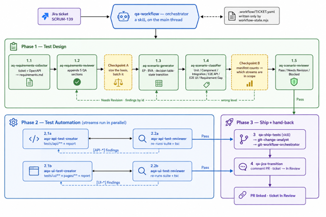

# QA workflow, simplified

One command takes a Jira ticket all the way to a pull request with tests:

```text
/qa-workflow SCRUM-139          # manual: asks you after every step
/qa-workflow SCRUM-139 --auto   # auto: routes on each review verdict, still asks before git
```

## The idea in one picture



*General concept schema: phases, checkpoints and review loops at a glance. The step list below is the
exact flow.*

```text
             Jira ticket
                  │
   PHASE 1 · TEST DESIGN
   1.1  requirements collector ──► requirements/SCRUM-139-requirements.md   (ticket → In Progress)
   1.2  requirements reviewer  ──► adds gaps, risks, open questions
   1.3  scenario generator     ──► test-design/SCRUM-139-test-design.md     (scenarios + test level)
   1.5  scenario reviewer      ──► Pass / Needs Revision
                  │
   PHASE 2 · AUTOMATION  (two streams in parallel)
        API stream                         UI stream
   2.1a API test creator             2.1b UI test creator
   2.2a API test reviewer            2.2b UI test reviewer
        └────── Needs Revision? fix and review again (capped) ──────┘
                  │
   3   ship     ──► branch, commit, push, pull request
   4   hand back ──► PR link on the ticket, ticket → In Review
```

## What makes it work

| Piece | Role |
|---|---|
| **Orchestrator** (`qa-workflow` skill) | The QA lead. Runs on the main thread, decides who goes next, owns all routing. |
| **Sub-agents** (`.claude/agents/`) | One job each. They never name each other, so routing lives in one place only. |
| **Creator / reviewer pairs** | Whoever writes never approves. Reviewers have no `Edit`/`Write`, so they can't quietly fix and pass. |
| **State file** (`.workflow/SCRUM-139.yaml`) | Where the run is, what each review said, how many rounds were spent. A run can stop and resume. |
| **Shared docs** (`docs/automation/`) | The rules both halves of a stream read: etalon specs, contracts. Creator and reviewer judge by the same words. |
| **Scripts** (`scripts/*.mjs`) | Anything that must be exact: counting, linting the design and the specs, writing the state file. Models judge; scripts count. |
| **Review caps** | Code: max 2 revision rounds, then a human is asked. Design: 1 round, open findings go into the PR. |

A stream the design doesn't need is skipped: no UI scenarios means no UI creator and no UI reviewer.

## How the run cost is calculated with hooks

No agent can report its own tokens, so the counting happens outside the conversation, in hooks on the
`Agent` tool (`.claude/settings.json` → `.claude/hooks/agent-metrics.mjs`):

```text
orchestrator calls Agent ──► PreToolUse   writes a "started" record
        sub-agent runs      ── Claude Code saves its transcript, with token usage per API call
sub-agent returns       ──► PostToolUse  sums the transcript, appends one row to
                                          .workflow/metrics/SCRUM-139.jsonl
                     (fails) PostToolUseFailure records it as interrupted
end of run              ──► node .claude/hooks/metrics-report.mjs SCRUM-139   → cost table
```

- **Tokens come from the transcript**, not from what the agent says about itself.
- **Price = tokens × the model's list price**, with cache reads and writes at their own rates.
- **Unknown stays unknown.** An interrupted run or an unknown model is left unpriced and counted, never guessed.

Result: a per-step table (which agent, how long, how many tokens, how much) for every ticket.

## How I built it

1. **Drew the vision first.** On paper: the steps from ticket to pull request, and who does what.
   No code before the picture was clear.
2. **Brainstormed it with `grill-me`.** Claude asked me one question at a time until the gaps showed:
   who approves, what happens when a review fails, where state lives, when a human must decide.
3. **Planned it as separate components.** Each agent, script and hook was its own item with its own
   done-condition, built and tested one at a time before it joined the chain.
4. **Tested manually and with a code agent.** I ran real tickets through it and read every output; a
   code agent helped check contracts, review the code and write script tests.
5. **Rewrote it many times.** Every real run exposed something: a rule two agents read differently, a
   number counted by hand, a loop that never ended. Each fix moved a rule into one shared doc or one
   script, which is why the workflow looks the way it does today.

The lesson: **draw it, get grilled, build it in small pieces, run it for real, and expect to rewrite.**
