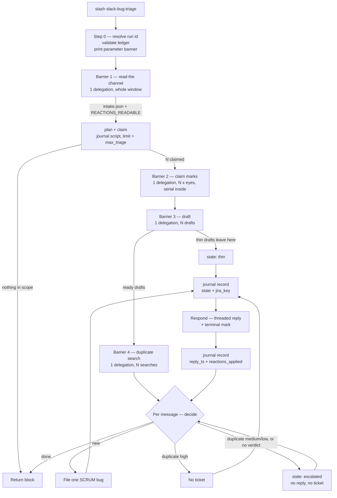
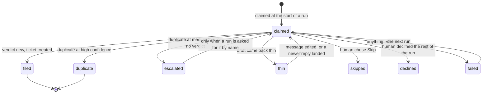

# Slack bug triage — how the workflow works

**Documentation, not instructions.** Nothing loads this file at run time. `SKILL.md` is the orchestrator
and the only executable account of the workflow; where the two disagree, `SKILL.md` is right and this file
is out of date.

It keeps the house rule the rest of the skill keeps: **it names no agent.** Steps are referred to by what
they do and what they may touch. The one place the five agent names appear next to each other is the step
registry in `SKILL.md`, because that is where routing lives.

---

## 1. What it does

One command turns a Slack bug-reports channel into Jira tickets:

> read the channel → claim each untouched message → draft a bug from it → ask SCRUM whether that bug
> already exists → either file a new ticket or point the reporter at the existing one → reply in the
> thread and mark the message → write down what happened.

```
/slack-bug-triage [--channel <id>] [--auto] [--since 7d] [--max-messages 25]
                  [--max-files 5] [--dry-run] [--resume]
```

Manual mode (the default) asks a human before every ticket. Auto mode routes on the duplicate verdict
under a hard file cap. Neither mode ever edits, comments on, closes or transitions a ticket it matched —
the only outputs are *new bugs*, *threaded replies* and *emoji*.

## 2. The run, end to end

Three read-only barriers, then a strictly sequential per-message tail.



**Why the shape splits where it does.** The three barriers only *read* — each has one uniform failure mode
(auth, parse, query) and a failure in any of them fails the whole run anyway, so batching them costs three
subagent launches instead of `3N` and loses nothing. The tail is per message because each step there acts
irreversibly on an external system, and the blast radius of a crash has to be exactly one message.

Barrier 2 *writes* and batches anyway: a reaction is one API call, reversible, and carries no meaning the
ledger does not already hold, while a subagent launch per call (~23k tokens, ~14s measured) is the most
expensive thing in the run for the least work done. **Batching is not fan-out** — the marks still go on one
at a time inside that single delegation, because Slack's reaction endpoint takes roughly one call a second.

## 3. Who may touch what

The split into five steps is by **tool grant and failure mode**, not by concept. This table is the whole
security model of the run.

| Step | Reaches | Writes | Why it is its own step |
|---|---|---|---|
| read the channel | Slack (read) | one intake file | stays pure, so it is re-runnable after any crash |
| draft the bugs | **nothing** — no MCP at all | draft files | zero external reach is what lets `--dry-run` exercise the real pipeline |
| duplicate search | Jira (read) | one verdicts file | changes nothing, so a wrong answer is free to re-run |
| file the bug | Jira (read + create) | **one** SCRUM bug per run | one irreversible act per invocation, so a `BUG_KEY` on the receipt is unambiguous |
| respond in Slack | Slack (write) | reply + reactions | every Slack write in one place, so the two server-gated tools have one home |

Nobody in that column decides anything about routing, and none of them knows the others exist. The
orchestrator owns the ledger, the routing decisions and the caps — and owns nothing else.

## 4. The ledger — why emoji cannot be the state

The design asks for messages "not already marked with an eye or a tick", which needs reactions to be
**readable**. The official Slack MCP server does not return them from its read tools
([slackapi/slack-skills-plugin#26](https://github.com/slackapi/slack-skills-plugin/issues/26), open since
2026-04-05) and the third-party one does not document whether it does. A reaction may therefore be
write-only: settable, never visible again, and so never removable by a run that died — which would strand
a claimed message forever.

So **`.slack-triage/journal.jsonl` is primary and reactions are decoration**:

- The ledger is append-only JSONL, one record per `(channel, message_ts)` event.
- `${CLAUDE_PLUGIN_ROOT}/scripts/slack-triage-journal.mjs` is the only thing that may write it. Never hand-edit it.
- Reactions are applied as a *union* — the extra "somebody marked this by hand" exclusion fires only when
  the channel read reported `REACTIONS_READABLE: yes`, resolved per run from the response itself, so a
  server that starts returning reactions switches the rule on by itself.
- It is **tracked in git** (`merge=union` in `.gitattributes`), unlike `.workflow/` and `.jira-bug/`: it is
  the only durable statement that a Slack message already became a ticket, and ignoring it means a second
  machine refiles everything.

### Per-message state machine



`filed` and `duplicate` are **terminal** and the script refuses to overwrite them with a different outcome
(exit `4`). Everything else is a waypoint. An escalation is a *finished outcome*, not a failure.

### The skip filter is code, not judgement

```bash
node "${CLAUDE_PLUGIN_ROOT}/scripts/slack-triage-journal.mjs" plan --intake <p> --reactions-readable <yes|no> \
                                           --run-id <ID> --limit <max_triage> --json
```

`plan` folds the ledger, takes the last record per message and prints one row per message with `in_scope`
and a reason. Twelve reasons: `new`, `resume`, `lease_expired`, `retry_after_failure`, `thin_answered`,
`reacted_elsewhere`, `claimed_by_live_run`, `thin_unanswered`, `awaiting_human`, `previously_declined`,
`deferred_over_limit`, `terminal`. **Route on those rows.** Deciding by eye what is already done is the one
thing this script exists to stop.

`deferred_over_limit` is the only reason that says nothing about the message — it is a property of *this
run's budget*, and the same message is `new` next run with nothing about it changed.

## 5. The two message caps, and why both exist

| Cap | Default | Applied to | Effect |
|---|---|---|---|
| `max_messages` | 25 | what the channel read returns | bounds the read and the reaction burst |
| `max_triage` | 5 | rows `plan` already ruled in scope | bounds what the run actually works |

They are **not interchangeable, and only one can make a repeated run advance.** The reading step holds no
ledger tool, so a cap applied there returns the same oldest messages every run — all terminal after the
first — with the backlog sitting untouched behind them. `max_triage` spends its budget only on untracked
work: run one takes the oldest five, run two takes the next five. That is the whole of "run it again and
nothing is missed", and it only works in that order.

`--limit` goes to **both** `plan` and `claim`, always the same value, or the surplus is leased by a run
that will never work it.

Other caps: `max_files` 5 (tickets an unattended run may create), `max_candidates` 10 (search hits read per
message), `lease_minutes` 30, `since` 7d — and a window older than 30 days needs `--allow-backfill`.

## 6. Nine fields, four of which a human can supply

`${CLAUDE_PLUGIN_ROOT}/scripts/lib.js` demands nine fields and treats all nine alike. A person
writing in a chat channel supplies four at best, so left alone **every message is thin and nothing is ever
filed**. The split:

- **Reporter-supplied — absence makes a report thin:** `summary`, `steps`, `expected`, `actual`.
- **Run-level defaults — never make a report thin:** `phase`, `priority`, `version`, `initialCondition`,
  `affectedTests`. Each lands on the draft's `inferred` list and each is printed in the parameter banner —
  a board silently filling with `Development` bugs all found in production is the failure that split exists
  against.

A thin report gets **one** threaded question naming exactly the missing fields. The missing set is hashed,
so the same question is never asked twice — which is what stops a bot pinging a reporter until they mute
the channel.

Full rules: `${CLAUDE_PLUGIN_ROOT}/skills/slack-bug-triage/references/slack-bug-intake.md`.

## 7. The duplicate decision

A verdict is `new` or `duplicate`; a `duplicate` carries a key, a confidence band and a one-line
justification naming the *evidence*.

| Band | Earned by | Auto mode does |
|---|---|---|
| `high` | same route/screen/operation **and** a matching observable — two independent fields agree | reply + `bulb` mark |
| `medium` | same route, symptom consistent but not verbatim; or matching observable, route unstated | **escalate** |
| `low` | overlapping wording only | **escalate** |

Same **defect**, not same **area**: the test is whether fixing the matched ticket would close this report
too. A wrong `high` buries a real bug under an unrelated ticket where nobody looks again — so a duplicate
verdict never closes, comments on or transitions the ticket it matched, and recovery is removing an emoji.

Full rules: `${CLAUDE_PLUGIN_ROOT}/skills/slack-bug-triage/references/triage-verdict-contract.md`.

## 8. Ordering, idempotency, resume

**Journal after Jira, before Slack.** A crash between the create and the record refiles the bug; a crash
between the record and the reply loses only a reply, which the next run posts. One is recoverable, the
other is not — so the ordering is not a preference.

The reply and the reactions are journaled as **separate fields**, so a response that posted the reply and
failed the mark is finishable without posting a second reply.

Idempotency is doubled on purpose:

1. **The ledger** — protects against a crash between creating a ticket and recording it.
2. **A `slack-<channel>-<ts>` label** on every filed bug, searched before any create — protects against a
   lost ledger, a second machine and a fresh checkout.
3. **The lease** — a dead run releases its messages by expiry (30 min), not by cleanup, because a
   write-only reaction cannot be taken back.

A resume is the same command again. `claim` exiting `4` means another run holds a live lease: stop, and say
which run holds it.

## 9. Failure modes worth drawing

| Signal | Where | What happens |
|---|---|---|
| `SLACK_WRITE_FORBIDDEN` | barrier 2 probe | **the whole run stops** — the token reads but cannot write, and finding that out after filing five tickets nobody can be told about is the worst available outcome |
| `not_in_channel` | the channel read | the bot was never invited. Fails before anything is drafted, searched or filed — the cheap direction |
| channel read `PARTIAL` | barrier 1 | record the oldest ts reached; the uncovered remainder is never treated as handled |
| duplicate search `PARTIAL` | barrier 4 | a message with no verdict is **never** routed as `new` |
| responding `PARTIAL` | the tail | record the halves separately, finish the other next run |
| `REACTIONS_READABLE: no` | every run | a hand-marked message is not honoured, and the return block must say so |

## 10. Setup

`SLACK_MCP_XOXB_TOKEN`, `SLACK_TRIAGE_CHANNEL_ID` and `SLACK_TRIAGE_SELF_USER_ID` are **OS environment
variables, not `.env` keys** — `${VAR}` in `.mcp.json` expands from the process environment, and a
project’s `.env` is read by that project’s own code, never by an MCP server definition.

- Posting and reacting are **off unless enabled**: `SLACK_MCP_ADD_MESSAGE_TOOL` gates the message tool,
  `SLACK_MCP_REACTION_TOOL` gates both reaction tools. Both are set to the **channel id**, never `true`.
- The credential is a **bot** token (`xoxb-`), so the app must be invited once by hand:
  `/invite @<app-name>` in the channel. A bot reads no channel it is not a member of, public ones included.
- `.claude/settings.local.json` must carry `"slack"` in `enabledMcpjsonServers`. That file is gitignored,
  so it is an operator step, not a repository change.

Details, scopes and the reactions probe: `${CLAUDE_PLUGIN_ROOT}/skills/slack-bug-triage/references/slack-mcp.md`.

## 11. Dry run

`--dry-run` touches neither Slack nor Jira nor the real ledger, and still exercises most of the pipeline:

- `plan` runs for real against a **temp ledger**.
- The drafting step is delegated for real — it holds no MCP grant, so it cannot reach anything it should not.
- Everything with a side effect prints instead: the JQL that would have run, the `createPayload` that would
  have been sent, and every Slack write — channel, `thread_ts`, emoji, and the rendered reply body.

That covers the intake contract, the whole skip filter, the whole drafting path, both templates and every
routing decision. Only four MCP calls go untested.

## 12. File map

Paths are relative to the plugin root (`${CLAUDE_PLUGIN_ROOT}`); the last two are relative to the project
being triaged.

```
skills/slack-bug-triage/
  SKILL.md                          the orchestrator — routing, caps, the ledger, the return block
  README.md                         this file (documentation only)
  references/run-shape.md           the per-message state machine and the resume rules
  references/slack-mcp.md           the server, its two gates, the token, what it cannot tell you
  references/slack-bug-intake.md    message -> draft; read by the two steps that must agree
  references/triage-verdict-contract.md   duplicate -> route; same reason
  assets/filed-reply.template.md    posted verbatim, never composed by hand
  assets/duplicate-reply.template.md
  assets/thin-report-reply.template.md
agents/triage-*.md                  the five steps — one file each, none naming another
scripts/slack-triage-journal.mjs    the only writer of the ledger; owns the skip filter
scripts/draft-bug.js, lib.js        the draft builder and the nine required fields
scripts/config.json                 the Jira project, its fields, the dedupe settings
scripts/__tests__/                  the journal suite — run with `node --test "scripts/__tests__/*.test.mjs"`

.slack-triage/journal.jsonl         the ledger — tracked in git, merge=union
.slack-triage/runs/<run_id>/        intake.json, drafts-index.json, verdicts.json, per-message drafts
```

Every reply ends with `_(automated triage)_`, which is how the next run's channel read knows not to file a
ticket about its own reply. Never edit that line out.

## 13. Drawing notes

If this becomes a picture, the four things worth the ink:

1. **The barrier/tail split** — three wide fan-in boxes, then a narrow sequential column. Label the tail
   "blast radius = one message".
2. **Three lanes: Slack · the repo · Jira.** Draw each step as a box straddling only the lanes it may
   reach; the drafting step touches only the middle lane, and that is the whole reason `--dry-run` works.
3. **The ledger as the spine**, with the write ordering marked: *Jira -> journal -> Slack -> journal*. The
   two journal writes are the picture's load-bearing detail.
4. **Emoji drawn as a dotted overlay**, never as a state. The solid line is the ledger.
